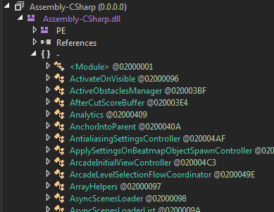

# Extras
_Les bases n'étaient pas suffisantes ? Voici des outils supplémentaires que vous pourriez utilisez ! _

::: danger
Cette page est en cours de traduction et n'est pas viable en l'état. Veuillez-vous référer à la [version originale en anglais](/modding/extras.md) en attendant.
:::

Vous trouverez ici du contenu supplémentaire et des informations qui vous aideront à créer un plugin. Inspecter le code source, accéder à des paramètres privés et utiliser des librairies externes sont des choses que font les plugins de BeatSaber. Alors pourquoi seulement vous en tenir aux bases ?

Vous trouverez ici des programmes et des librairies qui vous permettront d'aller plus loin avec vos plugins et qui vous aiderons grandement si vous décidez de tester de nouvelle chose dans le monde du modding sur BeatSaber. Rappelez-vous, le [Discord Beat Saber Modding Group](https://discordapp.com/invite/beatsabermods) est toujours là pour répondre à vos questions de programmation !

::: danger
Cette page du wiki est incomplète ! Si vous souhaitez traiter une librairie ou un aspect du modding, n'hésitez pas à m'envoyer un message privé sur Discord `Caeden117#0117` et dites-moi quoi ajouter.
:::

## Construction avancée

Si vous en avez marre de devoir copier vos projets finis depuis des dossiers perdus dans votre dossier de projet pour les mettre dans votre dossier Plugins, cette catégorie vous aidera à réduire les efforts que vous aurez à faire en ayant juste besoin de construire vos projets et d'ouvrir Beat Saber pour les tester.

### Symlinks

Un `symlink` est quelque chose qui va indiquer à Windows qu'un fichier est lié à un autre dossier. C'est utile si vous voulez un dossier sur votre bureau qui vous mène directement dans votre dossier Beat Saber quand vous l'ouvrez, ou dans votre cas, un symlink depuis votre plugin dans votre dossier plugin jusqu'à la dernière version dans votre dossier de projet.

::: warning
Si un dossier contient des espaces (Exemple : `cd C:\Users\Test\Hello World`), encadrer le chemin entre des guillemets: `cd "C:\Users\Test\Hello World"`
:::

1. Ouvrez l'invité de commande en tant qu'Administrateur.
2. Assurez-vous qu'il n'y a pas de plugin dans votre dossier de plugin.
3. Ciblez votre invité de commande sur votre dossier de plugin Beat Saber (`cd <Beat Saber Directory>/Plugins`)
4. Exécutez la commande suivante: `mklink <Plugin Name>.dll, <Path to your build file>`

Ci-dessous, un exemple de la commande `mklink` :
```
mklink ExampleMod.dll, "C:\Users\You\Documents\Visual Studio 2017\Projects\ExampleMod\ExampleMod\bin\Debug\ExampleMod.dll"
```

Si tout a été fait correctement, la prochaine fois que vous ferez un plugin et que vous lancerez Beat Saber, les plugins devraient se mettre à jour automatiquement.

### Post-Build Events
Une autre façon de faire ça et de tirer profit des C#'s post-build events. Cela ne vous permez pas seulement de copier des fichier dans un emplacement quand vous avez fini, mais ça vous permet aussi de faire beaucoup d'autre chose. [Voici des documents sur le pre/post build events](https://docs.microsoft.com/en-us/visualstudio/ide/how-to-specify-build-events-csharp?view=vs-2017) (en anglais)

1. Sous `Project`, cliquez sur `<Project Name> Properties...`
2. Cliquez sur `Build Events`
3. Copiez Collez le code suivant dans la ligne de commande Post-build event:
`copy /Y "$(TargetPath)" "<Path to Beat Saber Plugins folder (Including the file name and extension)>"`
4. Sauvegardez et quittez.

Voici un exemple de la commande post-build:
`copy /Y "$(TargetPath)" "D:\Oculus\Software\Software\hyperbolic-magnetism-beat-saber\Plugins\ExampleMod.dll"`

`$(TargetPath)` indique l'emplacement du fichier que vous etes en train de faire, quelque soit ce que vous utilisez pour le faire.

Si tout a été fait correment, la prochaine fois que vous ferez un plugin, une copie sera automatiquement envoyé dans votre dossier plugin (il remplacera automatiquement les versions précédentes), et Beat Saber sera en état de marche.

## dnSpy

dnSpy est un debbugeur .NET et un éditeur d'assemblage qui vous permet d'importer des fichier .dll compilés et de les voir non compilés dans C#.

Dans le cas du modding, on peut utiliser dnSpy pour voir le code source de Beat Saber afin de trouver de trouver des méthodes ou des variables qui pourraient être utiles dans des plugins.
Apprennez en plus [ici](https://github.com/0xd4d/dnSpy).

* Téléchargez la [dernière version de dnSpy.zip](https://github.com/0xd4d/dnSpy/releases/tag/v6.1.4)
* Décompressez le zip et lancez `dnSpy.exe`.

Si tout a été fait correctement, cela devrait ressembler à ça, sans la grande liste de fichier sur la gauche.


Allez dans `File >> Open`, puis trouvez et ouvrez le code compilé de Beat Saber qui se trouve dans `\<Beat Saber Directory>\Beat Saber_Data\Managed\Assembly-CSharp.dll`


Vous pouvez aussi utiliser dnSpy pour voir et même éditer le code des plugins, même ceux qui n'ont pas encore été publié sur GitHub. Cependant soyes prudent ! Fouiner dans le code des autres sans permission est une très mauvaise idée.



## Harmony

Harmony est une librairie pour corriger des .NET compilés et des mono methods pendant l'exécution. Cela vous permet de modifier les fonctions principales de Beat Saber et permet au plugins de faire des choses bien au dela de ce que les basic Illusion Plugion Architecture peuvent faire.

Apprenez en plus [ici](https://github.com/pardeike/Harmony)

Harmony est compris avec BSIPA, donc vous avez juste besoin de l'ajoutez en tant que référence ([Cliquez ici si vous avez oublié comment ajoutez une référence à votre projet](https://bsmg.wiki/modding/example-mod.html#references-and-text-mesh-pro) (dead link apparament). Il se trouve dans `Beat Saber/Libs`.

À cause de ça, il est très mal vu d'ajoutez Harmony en tant que dépendance quand vous finissez un mod. En faite, [c'est une infraction révocable dans les lignes de conduites approuvées de BeatMods](https://docs.google.com/document/d/15RBVesZdS-U94AvesJ2DJqcnAtgh9E2PZOcbjrQle5Y/edit), référez vous à la ligne `3.1.b`.

### Tutoriel Simple
Arrive bientôt, je vais essayer de faire un tutoriel pas trop long mais qui vous permettra de comprendre les bases pour utiliser Harmony.

## Reflection Util
ReflectionUtil est un simple fichier qui permet de prendre et de modifier des variables privées à l'intérieur de fichiers. Il est utilisé avec [dnSpy](https://bsmg.wiki/modding/extras.html) pour chercher et récupérer des variables dans le code. Vous voulez modifier des variables privées ? Utilisez plutôt [Harmony](https://bsmg.wiki/modding/extras.html).

Reflection Util est disponible dans beaucoup de mod, [en voici un qui vient de Beat Saber Utils](https://github.com/Kylemc1413/Beat-Saber-Utils/blob/master/Beat%20Saber%20Utils/Utilities/ReflectionUtil.cs)

### Depuis Beat Saber Utils
Si vous ne l'avez pas déjà fait, [ajoutez Beat Saber Utils en référence à votre projet.](https://bsmg.wiki/modding/intro.html#fixing-references)
Depuis là, ajoutez `using BS_Utils.Utilities;` au dessus de vos fichier et accédez y en utilisant `ReflectionUtil`.

### Créer le votre
* Créez un nouveau fichier s'appelant `ReflectionUtil.cs`
* Copiez Collez le code ci-dessus dans le nouveau fichier, assurez vous de remplacer `namespace BS_Utils.Utilities` avec le nom de votre projet.

### Utilisation simple
Voici une utilisation simple de `ReflectionUtil`, en prenant les deux sabres depuis la classe `PlayerController`.

