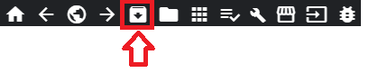

# Modding sur Quest

## Installation

Actuellement le seul moyen recommandé pour installer les custom songs et les mods est BMBF chargé à travers SideQuest.
* [BMBF apk](https://bmbf.dev/stable)

### Installer BMBF avec SideQuest

Si vous ne l'avez pas encore fait, téléchargez et installez [SideQuest](https://sidequestvr.com/#/setup-howto) (en anglais).

Ouvrez SideQuest et connectez votre Quest à votre PC. Si vous avez déjà moddé Beat Saber ou si vous avez des scores que vous voulez sauvegarder, allez dans `My Apps` situé dans la barre supérieure de la fenêtre et trouvez Beat Saber.

Cliquez sur la roue juste à côté et appuyez sur le bouton `BACKUP GAME DATA`, si vous avez un jeu moddé vous devez aussi le désinstaller en utilisant le bouton `UNINSTALL APP`.

Vous pourrez restauré votre sauvegarde depuis le même menu, après le modding.

Installez le dernier APK de BMBF via le bouton `Install APK from folder` indiqué ci-dessous.

Une fois qu'ils sont installés avec succès, assurez-vous que la dernière version de Beat Saber est installée et non moddée.
:::warning AVERTISSEMENT
Lancez Beat Saber une fois et fermez-le avant de le modder !
:::

Après avoir lancé Beat Saber une fois, ouvrez BMBF depuis l'onglet `Oculus TV channels` ou `Unknown Sources` dans votre bibliothèque. Suivez chaque étape en suivant les indications, puis vous devriez être en mesure de voir [bsaber.com](https://www.bsaber.com). C'est ici que vous pouvez télécharger n'importe quelle custom song disponible.

## Restaurer les données sauvegardées

### Restaurer depuis SideQuest

Retournez dans le même menu dans lequel vous avez fait la sauvegarde de vos données et cliquez sur le bouton `OPEN BACKUPS`.
D'ici, trouvez le dossier de sauvegarde le plus récent, ouvrez-le et supprimez le dossier Mods (pour éviter que des mods potentiellement incompatibles ou obsolètes fassent dysfonctionner votre jeu).

Ensuite, retournez dans le menu et appuyez sur la flèche circulaire située à côté de votre dernière sauvegarde. Ceci afin de restaurer vos scores.
Le bouton est mis en évidence sur [cette image](#installer-bmbf-avec-sidequest).

## Installer les mods

:::warning AVERTISSEMENT
Assurez-vous que votre Quest et votre PC sont sur le même réseau !
:::

Ouvrez BMBF dans votre Quest et rendez-vous dans l'onglet `Tools`, ici vous devriez voir une addresse web et un numéro de version similaires à ce qui est affiché ci-dessous.

Sur votre PC, ouvrez votre navigateur et entrez l'adresse dans la barre de recherche.

Vous devez être accueilli par cet écran.

Maintenant, glissez simplement n'importe quel mod compatible avec le Quest dans la boîte d'upload et synchronisez. Si le mod est fait pour une autre version à la base, il ne s'activera pas automatiquement. Pour activer un ancien mod, rendez-vous dans l'onglet `Mods` et activez-le d'ici.

Si vous voulez utiliser la même méthode de téléchargement de custom songs comme vous pouvez le faire avec BMBF dans le Quest, remplacez simplement `upload` dans l'URL par `browser`.

## Installer des maps

### Dans votre Quest
Il y a 2 sources pour récupérer des maps dans votre Quest en utilisant la fenêtre du navigateur.
* Si vous cherchez des maps et des playlists, visitez [BeastSaber](https://bsaber.com/)
* Si vous n'aimez pas l'interface de BeastSaber vous pouvez aussi essayer [Beatsaver](https://beatsaver.com/)

Les deux ont un bouton en un clic (1click button) qui installe facilement la custom song dans votre Quest. Vous pouvez alterner entre les sites en utilisant l'icône du globe en haut à droite de la fenêtre de votre navigateur.

### Avec votre PC
Si vous ne pouvez pas installer des custom songs dans votre Quest, vous pouvez installer les maps en utilisant votre ordinateur de la même manière qu'en installant les mods.
1. Visitez [BeastSaber](https://bsaber.com/) ou [Beatsaver](https://beatsaver.com/) sur votre ordinateur
2. Téléchargez le zip
3. Suivez les étapes pour [Installer les mods](#installer-les-mods) jusqu'à l'écran d'upload des fichiers.
4. Glissez et déposez le zip de la map et elle devrait s'installer !

:::tip ASTUCE
Si vous voules tester une map que vous avez créée, allez voir la section [Testez sur Oculus Quest](/fr/mapping/#tester-sur-oculus-quest) dans la partie sur le Mapping pour les étapes d'assemblage pour le test !
:::

## Liens utiles et guides alternatifs

* [Guide d'installation de BMBF sur Oculus Quest](https://bsaber.com/oculus-quest-custom-songs/) (en anglais)
* [Guide général par Sc2ad pour apprendre les bases du modding statique](https://github.com/sc2ad/beat-saber-community-wiki/blob/master/asset-modding-guide.md) (en anglais)
* [Collection de tous les guides actuels pour les mods statiques tels que les sabres et les notes, fait par RedBrumbler](https://github.com/RedBrumbler/BMBFCustomSabers/wiki/RedBrumblers-Asset-Mod-Guide-Wiki) (en anglais)
* [QuestSaber Community](https://discord.gg/NXnPYEh) - Un serveur dédié à la création et l'utilisation de sabres pour Quest
* [Guide pour créer des Qsabers](https://github.com/RedBrumbler/BMBFCustomSabers/wiki/Creating-Qsabers) (en anglais) - Des sabres spécifiques au Quest qui restent compatibles entre les différentes mises à jour du jeu
* [Corriger le problème de synchronisation audio](https://bsaber.com/quest-out-of-sync/) (en anglais)

## Dépannage
### Ajouter des mods depuis bsaber.com ne fonctionne pas
La raison de pourquoi l'ajout de mods et sabres depuis [BeastSaber](https://bsaber.com/) ne fonctionne pas est que ces mods et sabres sont faits par le PC seulement. Pour ajouter des mods et sabres pour le Quest, utilisez l'interface web BMBF. [Comment accéder à l'interface web BMBF](#installer-les-mods)

Récupérez les sabres et mods compatibles Quest dans `#quest-mods` ou `#quest-assets` sur le Discord Beat Saber Modding Group, ou bien vous pouvez trouver des sabres pour Quest sur le [Github de RedBrumbler](https://github.com/RedBrumbler/BMBFCustomSabers), ou sur sur le serveur [QuestSaber Community](https://discord.gg/NXnPYEh). Une fois que vous avez votre `.zip`, utilisez [l'interface web BMBF](#installer-les-mods) pour l'installer.
___
### Le chargement de BMBF ne fonctionne pas
Quand au chargement de BMBF avec SideQuest vous obtenez l'erreur `INSTALL_FAILED_UPDATE_INCOMPATIBLE: Package com.weloveoculus.BMBF signatures do not match the previously installed version; ignoring!"`

Vous devez désinstallez la version de BMBF de votre Quest. Vous pouvez le faire dans le menu `My Apps` de SideQuest.
___
### L'interface web BMBF ne charge pas
Si votre interface web BMBF ne charge pas, assurez-vous de bien saisir l'IP de l'onget Tools dans votre navigateur, qui est sur le même réseau.
Vérifiez que :
1) Votre IP n'est pas `127.0.0.1`
2) BMBF n'est pas ouvert dans le casque
3) Il y a bien `http://` au début du lien, pas `https://`
4) Vous avez bien `:50000` à la fin du lien
___
### BMBF ne charge pas la configuration après quelques minutes
C'est généralement dû à l'utilisation d'une version obsolète de Beat Saber utilisée avec BMBF.
Si vous n'utilisez pas une version obsolète essayez de redémarrer votre casque et, si cela continue, cliquez sur Quick Fix dans l'interface web BMBF.
___
### Mes sabres et mods ne s'active pas / ne fonctionne pas !
C'est généralement dû à un client BMBF obsolète, récupérez la [dernière version de BMBF](https://bmbf.dev/stable). Si la version de BMBF pour votre Beat Saber n'y est pas, merci de patienter le temps que les Unicorns mettent à jour BMBF.
* Si votre mod est normalement compatible avec votre version de BMBF, assurez-vous qu'il n'y a pas de dossier séparant le contenu du fichier `.zip`.
* Si votre niveau ne charge pas, essayez d'installer Mapping Extensions depuis `#quest-mods`
* Si votre BMBF est à la dernière version et les mods ne s'activent pas en jeu, désinstallez Beat Saber avec le bouton Uninstall BS dans l'onglet Tools de BMBF, puis réinstallez-le et moddez-le encore.
___
### Mon Beat Saber affiche 3 points quand je le lance !
Si votre Beat Saber affiche 3 points quand il est lancé, assurez-vous que :
1) Vous avez lancé et joué une chanson avant de modder le jeu
2) Vous n'utilisez pas une version piratée du jeu
3) Vous utilisez la dernière version de BMBF

