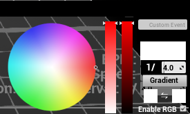
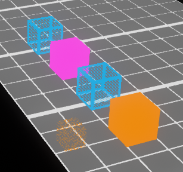
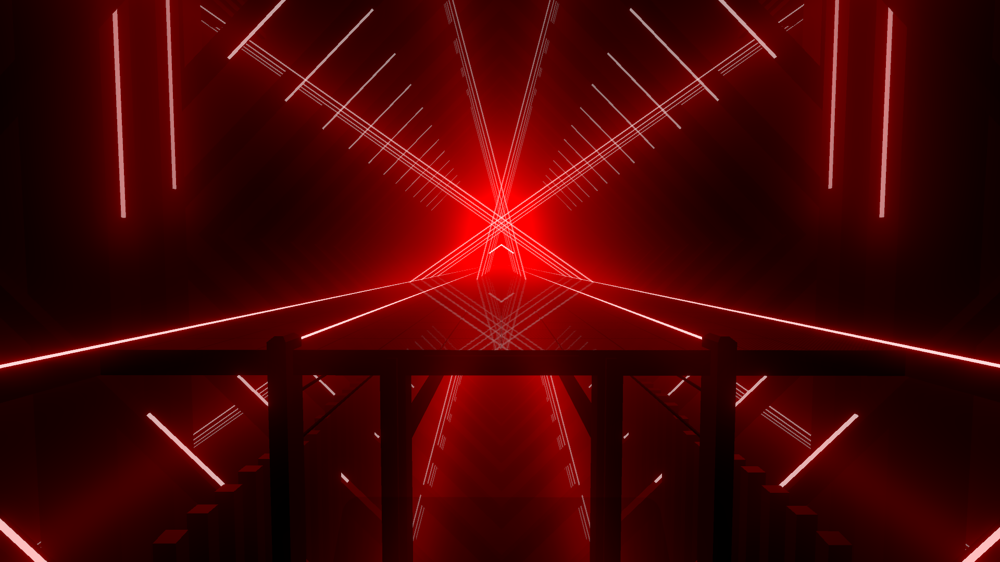
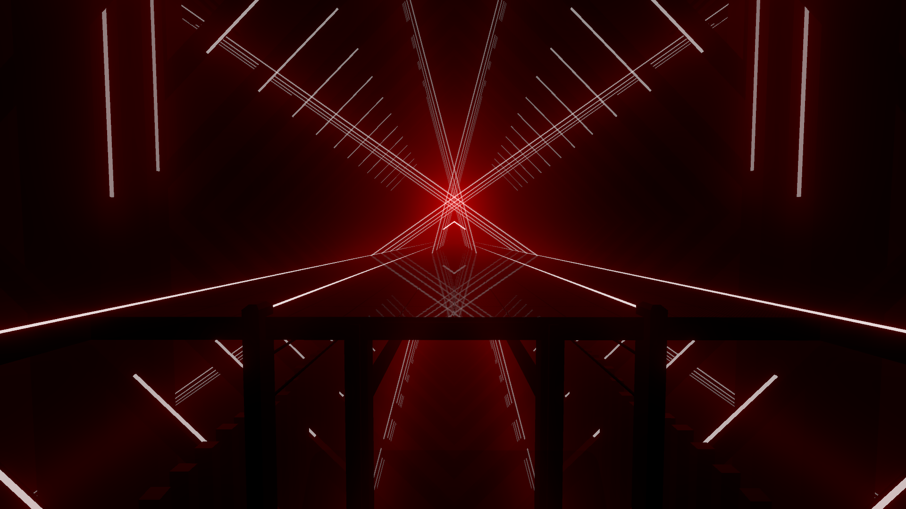
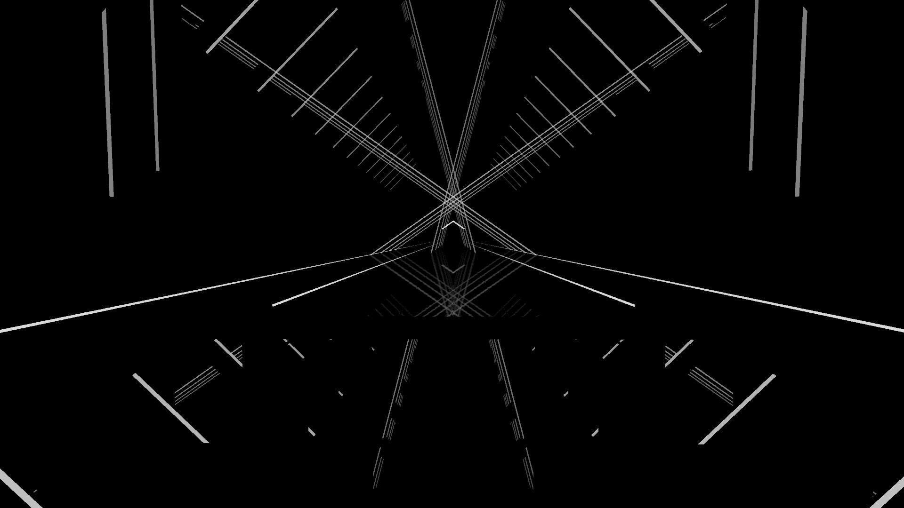
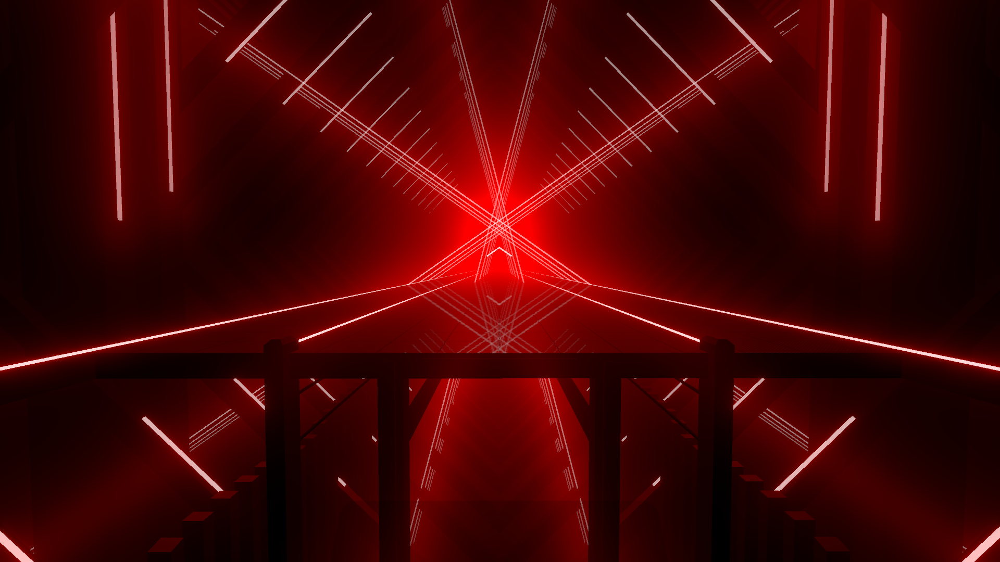
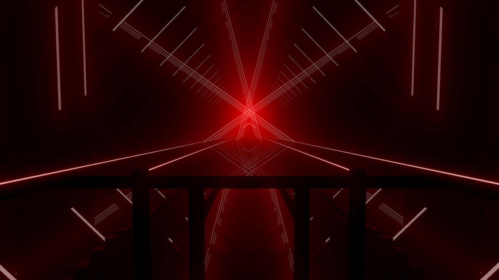
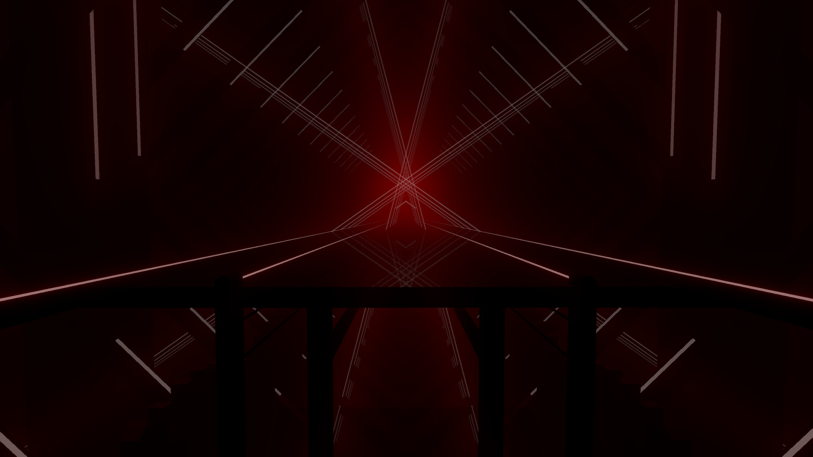

# Advanced Lighting
_You've dived into lighting and now you want to take it to the next level._

## !Notice! This is a Stub Page
:::warning
This is a stub page, content is a work in progress! Ask in `#mapping-discussion` if you want more info!
:::

## Advanced Info

> Lasers rotate at 20 degrees per second per point of speed. This is not tempo-dependent. - Asi

## Advanced Lighting Techniques

### Double Duty Lasers
You can overlap two laser "tracks" by using multiple colors in different patterns for an appearance of double the number of available laser types. Where the music supports it, you can help differentiate the two patterns by contrasting them in other ways, such as strobing one while leaving the other solid, or maintaining one color at speed 0 while keeping the other one moving.

Start by mapping out the most prominent, consistent, or complex pattern (whichever pattern you feel needs to be mapped most faithfully), then carefully craft the second pattern so the two never need to use the same specific laser at the same time. Worst case scenario, if you need to briefly overlap the two patterns, you can simply strobe the colors on the overlapping laser for a beat; be aware that sustaining this overlap will eventually disrupt the effect.

* Examples at ~1:52 and ~2:50:  
[Streamable](https://streamable.com/0qsto) | [BeatSaver](https://beatsaver.com/beatmap/7be2)


### Higher Impact Full On/Off Moments
Stagger timing for the on/off events across the light types when turning on all the lights for a big hit to create a punchier feeling as well as introduce a sense of movement. 

Instead of flashing or fading all lights simultaneously, flash them on in very fast front-back or back-front sequence, at 1/16 intervals or so; these can end in fades, with simultaneous offs, or similarly cycled offs at the same interval or often half/double that.

Front-back position varies by environment, and it can be a bit ambiguous with the rings and BBS often covering the entire length, but in Big Mirror, Default, and Triangle environments:
* BBS appears to be the furthest back
* Then back-top, 
* Then side lasers
* Finally, the rings appear the closest to the player. 

Examples: 
* Several distinctly timed examples starting at ~0:18:  
[Streamable](https://streamable.com/zx1sf) | [BeatSaver](https://beatsaver.com/beatmap/5bb2)
* A harder-hitting example at ~1:33:  
[Streamable](https://streamable.com/7tk24) | [BeatSaver](https://beatsaver.com/beatmap/44f4)

### Drumrolls

In many environments, if you stagger speed 0 laser strobes for brief periods interspersed with pauses, the lasers vaguely resemble rolling drumsticks; be aware that maintaining such a pattern for longer periods will result in more of a spin appearance, which is useful in other contexts but less-so for drumrolls. 

Mix in back-top or other compatible light types to control the speed of the roll and manage which "hand" each roll will end on as seems appropriate to the music.

* Example at ~2:23:  
[Streamable](https://streamable.com/0qsto) | [BeatSaver](https://beatsaver.com/beatmap/7be2)

### "Singing" Inner Rings

If you strobe inner ring zoom at varying frequencies (~1/4-~1/16 depending on pitch and tempo), you can produce an effect where the inner rings appear to "sing" the vocal melody. 

Of the base-game environments, this tends to work best in DefaultEnvironment, as the TriangleEnvironment inner rings have a less appropriate shape for the purpose, and the NiceEnvironment inner rings are prohibitively difficult to keep lit sufficiently for the effect to be noticeable.

Maintaining sufficient inner ring lighting in DefaultEnvironment is not difficult, but you should ideally leave the ring lights, BBS, or both On for the duration of the effect, since more dynamic lighting tends to mask it. Similarly, avoid using ring spins throughout the duration, since the effect becomes nearly unnoticeable while the inner rings are in motion.

* Examples at ~0:30, ~1:39, and ~2:20:  
[Streamable](https://youtu.be/YqM_eXIh2Sg) | [BeatSaver](https://beatsaver.com/beatmap/7be1)

### Wind-Up, Wind-Down

Gradually decreasing/increasing interval for laser spins is great for wind up/wind down sounds.

For example, start around 1/16, 1/17, 1/18... 1/32, or even all the way to 1/64 if the tempo supports it (beware of odd artifacts at typical speeds, though). Depending on what the music is winding up to, you can end it there, follow up with a rotating laser (looks like the momentum from the spin is transferred to the rotation), etc. If you wind up to a bass hit, following up with a shorter spin down in the opposite direction and at slower speeds, it looks like the spinning light hits a wall of sorts, loses most of its momentum, and bounces back.

The exact starting and ending intervals (on the interval change between events) should be adjusted depending on the nature and duration of the associated sound, and keep in mind you can set intervals to decimals for a change of .5 (for example) with each event.

* Wind-Down example ~1:03, Wind-Up with bounce back ~2:18:  
[Streamable] (https://streamable.com/zx1sf) | [BeatSaver] (https://beatsaver.com/beatmap/5bb2)

## Custom Environments
::: tip NOTE
This is an empty section. If you’d like to contribute, submit suggestions via [this form](https://docs.google.com/forms/d/e/1FAIpQLSfVS6_EMZOujxthR3lTa2eEwHg5C3x1INouLgnbHhBDpv1M5A/viewform).
::: 

## Chroma (RGB Lights)
The Chroma mod allows you to use more than two colours for lighting! Learn how to use it below.

### Set-up in MMA2
1. Open MMA2
2. In the Settings bar on the right, under the Legacy section, click on the ChromaToggle checkbox
3. Select the level you want to map in and click on the ExtraFields tab to the right of the difficulty select
4. Click on the Suggestions tab and then type in `Chroma`.
:::warning
The text you enter in the suggestions has to be exact or the Chroma lighting effects will not appear in game
:::
5. Click the Add button to add it to the suggestions.
6. Click Save song infos in the bottom left corner.
7. Click Edit Level.
8. While in the editor, press `Tab` to swap to the lighting menu and then press `Shift+C` to bring up the RGB panel.
<p align="center"> 
(The RGB panel)  

</p>

#### Controls
Select a Chroma event by clicking on the color wheel or adjusting the sliders to get the color you want.  
Save a Chroma color by right clicking on a square on the top of the RGB panel. Click on a square to select the saved color.  
Pick a colour from an already placed Chroma event by pressing `C` while hovering over the event.

Select a vanilla lighting event by clicking on an event from the normal lighting menu.

:::warning NOTE
MMA2 uses the older format for Chroma and it is recommended that you convert your map to the current format using the [ChromaNoodleConverter](https://github.com/CyanSnow/ChromaNoodleConverter/releases/latest) before releasing it. Be sure to make a backup before using this as the new format does not function in MMA2 and there is no "unconverting".
:::

### How Chroma Events Function
Chroma events don’t do anything on its own. Chroma events function by acting as a light filter for future events essentially “dying” the normal lighting events to the specified color. In the following example, the orange and pink events don’t do anything until the vanilla blue fade event happens. This functions as an orange fade and then a pink fade.
<p align="center"> 

</p>

:::warning
Do not place chroma events inside another event. It can cause issues when copy pasting and MM’s shoddy rounding can even place the chroma after the actual event and it won’t change colour. Completely avoid it. ~Halcyon12
:::

### Gradients
How to place a gradient using Chroma events: 
1. Underneath the gradient button, place the initial colour in the left box and the ending/final colour on the right box.
2. Click the gradient button.
3. Click on the starting point and again on the ending point (similar to placing a wall).

Gradients using a 1/8 precision are fine enough to look smooth in game. (Using too many events or too high of a precision can impact the game’s performance)

Remember that you still need to place the normal lighting events for the Chroma lights to function!
<p align="center"> 

</p>

### Custom Fades

Using darker shades of a color, allows you to emulate a custom fade in/out effect. Colors that have a that use a lower value will emanate less light (appearing darker). Using a gradient that starts or ends with a black color can give the feeling of a fade in / out event.
<p align="center">
Comparison of shades of red:
| 100% Value | 75% Value | 50% Value | 25% Value | 0% Value |
| :----: | :----: | :----: | :----: | :----: |
|  |  |  |  |  |
</p>

## Chroma 2.0
Chroma 2.0 is the latest version of Chroma providing even more options to spice up your lighting. This includes the ability to: create gradients without hundreds of events, individually light lasers, use precise laser events, and use precise rotation events.

All the available features are listed in the documentation: [GitHub](https://github.com/Aeroluna/Chroma/wiki/Mapping)

:::danger NOTE
Chroma 2.0 is currently only supported by ChroMapper.  
Opening a map in MMA2 will remove any Chroma 2.0 events from the difficulty.
:::

### Color Data

In the new Chroma format, the colour data is built into the vanilla lighting event. There's no need to place a Chroma event before the actual lighting event. The color data format now has an optional forth value for alpha. These can be used for even more convincing fades or for more subtle lighting.
<p align="center">
Comparison of the same red with different alphas.
| 1.00 Alpha | 0.75 Alpha | 0.50 Alpha | 0.25 Alpha | 0.00 Alpha |
| :----: | :----: | :----: | :----: | :----: |
|  |  |  |  |  |
</p>

### Chroma 2.0 Gradients

In comparison to the older format, gradients can be created with a single event using the `_lightGradient` property.
Example gradient linearly easing from red to blue over 2 beats:
```
"_customData": {
	"_lightGradient": {
		"_duration": 2,
		"_startColor": [1,0,0],
		"_endColor": [0,0,1],
		"_easing": "easeLinear"
	}
}
```

### Ring Prop / Light Prop

Chroma 2.0 allows you to control individual lights if an event normally triggers multiple lights. This effect is most visible on the ring lights.

### CM Node Editor

Many of Chroma's features are far easier to implement and edit using ChroMapper's Node editor.

## Technical Info (JSON Editing)

It can be helpful to know how a lighting event is encoded in the `.dat` files if you want to edit the file directly or make a script to change the file.

Event Types:  
* 0 - Back Top Lasers  
* 1 - Ring Lights  
* 2 - Left Lasers  
* 3 - Right Lasers  
* 4 - Center (BBS) Lights  
* 8 - Ring Rotation  
* 9 - Inner Ring Zoom  
* 12 - Left Laser Speed  
* 13 - Right Laser Speed  

If the event type is one of the lights (0, 1, 2, 3, or 4), then the values of the event determines what lighting event is used:
* 0 - Off  
* 1 - Blue On   
* 2 - Blue Flash  
* 3 - Blue Fade  
* 5 - Red On  
* 6 - Red Flash  
* 7 - Red Fade  
(Replace Blue and Red with the environment’s respective colours)

If the event type is a laser speed (12 or 13), then value of the event determines the laser speed.

An example event showing a Red Fade on the Left Lasers on beat 10:
```
{
  "_time" : 10,
  "_type" : 2,
  "_value" : 7
}
```


## Credits

The content on this page was authored by [LittleAsi](/mapping/mapping-credits.md#littleasi), [Puds](/mapping/mapping-credits.md#puds), [Skeelie](/mapping/mapping-credits.md#skeelie), and [Bullet](/mapping/mapping-credits.md#bullet).
