# Basic Lighting
_Make Beat Saber a brighter place by manually lighting your maps_

* [Glossary of Terms](/mapping/glossary.md)
---
Every map needs to have lighting of some sort. Once you know the tools at your disposal, simplistic manual lighting can be very easy. [This link](https://streamable.com/s/x7zj0/vrugyj) is a video example of very simple manual lighting  (Note: The example uses [Map Color Overrides](/mapping/basic-lighting.html#map-color-overrides)). You don't need to be an AaltopahWi or a Skeelie to make great lighting!

## Lighting Types
The available lighting types are consistent across each of the built-in game environments, though they may be in slightly different positions or not present in some cases.
* **Center Lights:** Generally lights along the side of the track, underneath the track, and sometimes a chevron at the back of the track. Sometimes called "Bottom/Back/Side" or "BBS" lights.
* **Side/Top Lasers:** Sets of rotating lasers to the sides of the track or above/below the track, depending on which environment you’ve selected. Rotation is set using the Laser Speed function.
* **Back Lasers:** Static lasers, often in an “X” pattern at the back of the track, behind the chevron.
* **Ring Lights:** Lights attached to the inside of the large outer rings that spin in almost all environments.
* **Ring Spins:** Used to create movement in the rings. In environments with both an inner and an our ring, rings spins rotate both rings together.
* **Ring Zooms:** Used to zoom and unzoom the inner ring in environments that have it. Does not affect the outer ring.
* **Laser Speed:** Changes the speed of the side laser rotation from stationary (0) to very fast (20). Set independently for the right and left side lasers. Back top lasers do not move. Laser speed increases linearly so **2** is twice as fast as **1** and **5** is five times as fast as **1**.

## Lighting Events
Each lighting type can make use of four different lighting events.
* **On:** Turns a light on that will stay on until you place a different event type.
* **Off:** Turning a light off can have as much impact as turning it on, or more.
* **Flash:** Briefly flashes brighter than a standard “on” event then stays on until you place a different event type.
* **Fade:** Briefly flashes brighter than a standard “on” event then fades off after a couple of seconds.

::: warning NOTE  
It's impossible to control the duration of a fade out or use a fade in with standard lighting. Custom fade durations require Chroma, which will be discussed in Advanced Lighting (coming soon).
:::

## Best Practices & Techniques
> "The only bad lights are **NO** lights.... or lightmap."  
~ Skeelie


Lighting truly is an art which means that it's much more subjective than mapping. There are relatively few best practices to get started and simple manual lighting is almost impossible to do poorly.

::: warning NOTE  
Lighting previews are not realistic in the editors currently available to the public so it’s important to preview your lights in-game often. See [Previewing Your Lights](/mapping/basic-lighting.html#previewing-your-lights) for some tools that can help.
:::

### Key Bindings
Each map editor handles lighting differently so you’ll want to get to know the key bindings and how placements work in your editor of choice. Lighting keybinds vary by editor. Consult your editor's user guide or readme or refer to this helpful list [Cross-Editor Keybindings](https://docs.google.com/spreadsheets/d/1iZLs80IH-KXeXE3NcNQA5kcc591XgAT-BUK6vZXcPAs/edit).

### Assigning Lighting Events
Mappers lighting their first map should start by assigning specific [lighting types](/mapping/basic-lighting.html#lighting-types) to specific instruments, then branch out from there as they get more experienced. This method won't usually produce the most exciting shows, but it's hard to mess up. This might look like:
- **Track Lights:** Bass or Kick Drum
- **Lasers:** Melody
- **Ring Lights:** Synth A or Cymbals
- **Ring Zoom:** Synth B

Once this type of basic structure is in place and you're more comfortable with how everything works, you can think about where you might want to change things up for emphasis. Establishing a strict pattern is necessary to create impact when you do make a change; if you emphasize everything, you emphasize nothing (this goes for block placement, too!).

**An example from Lighting Mentor, LittleAsi**

> I usually light the melody with all three lasers (vocal and instrumental on different colors, or primary instrumental and accents on a different color), drums on the ring lights, and either bass or something harmonic like synths on the Bottom/Back/Side (BBS) (a bit much sometimes since they increased BBS intensity). If the drums are too involved to pack onto the ring lights alone, or there's nothing else appropriate for the BBS, I'll move the kick drum to BBS. If the drums are really dominant, I may put the back-top laser on snare duty to dedicate the ring lights to cymbals. The numerous avenues for changing laser behavior and appearance do make them the best candidate for tracking the melody, though. I have used speed 0 lasers for closed hi-hat with various speeds for open hi-hat and cymbal crashes, though, so it definitely doesn't have to be any specific way (just internally consistent).

### Laser Speed Resets
Applying the same laser speed twice in a row will cause it to reset to a random position. For example, setting speed 1 on every snare hit will cause the laser positions to randomize in time with the snare without ever actually changing their rotation speed.

If you don't reset the laser speed it will continue to spin consistently at that speed until changed.

### Off Event Placement
The sounds within a song rarely have a precise end point so there's not always a "correct" time to place the `Off` event). Be aware of when you're choosing to turn lights associated with specific sounds or instruments off, and apply those decisions consistently throughout the song.

Be cautious about putting off events exactly in the middle of two lights as it can sometimes create an unintended strobing effect.

## Default Environments
There are various built-in environments in Beat Saber which are part of the base game and can be used easily with a few clicks.

::: warning NOTE
Custom environment models (platforms) created by the community exist but require the Custom Platforms mod which is not currently available through Mod Assistant. A beta version may be available in #pc-mods the BSMG Discord.
:::

The basic structure of each environment is mostly the same. In the [Mediocre Map Assistant 2](./mediocre-map-assistant.md) editor the lighting track looks like this:
<p align="center">
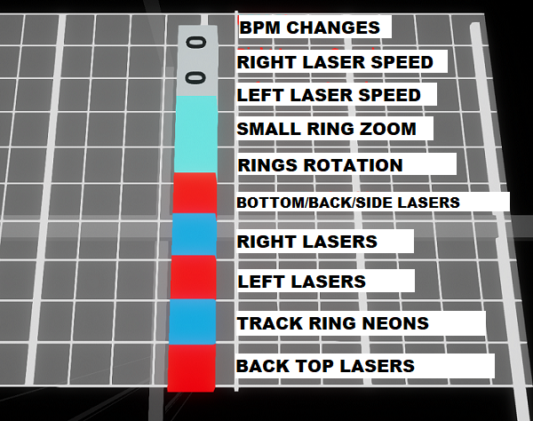
</p>

### Environment Previews
Many thanks to **Aeroluna** for the environment screenshots from game version 1.6. 

>**Note:** The images below were created using a program called ReShade which increases contrast in post-processing to better highlight lights. Environments appear less dark in-game.

| Visual (click to open full size) &nbsp;&nbsp;&nbsp;&nbsp;&nbsp;&nbsp;&nbsp;&nbsp;&nbsp;&nbsp;&nbsp;&nbsp;&nbsp;&nbsp;&nbsp;&nbsp;&nbsp;&nbsp;&nbsp;&nbsp;&nbsp;&nbsp;&nbsp;&nbsp;&nbsp;&nbsp;&nbsp;&nbsp;&nbsp;&nbsp;&nbsp;&nbsp;&nbsp;&nbsp;&nbsp;&nbsp;&nbsp;&nbsp;&nbsp;&nbsp;&nbsp;&nbsp;&nbsp;&nbsp;&nbsp;&nbsp;&nbsp;&nbsp;&nbsp;&nbsp;&nbsp;&nbsp;&nbsp;&nbsp;&nbsp;&nbsp;&nbsp;&nbsp;&nbsp;&nbsp;&nbsp;&nbsp;&nbsp;&nbsp;&nbsp;&nbsp;&nbsp;&nbsp;&nbsp;&nbsp;&nbsp;&nbsp;&nbsp;&nbsp;&nbsp;&nbsp;&nbsp;&nbsp;&nbsp;&nbsp;&nbsp;&nbsp;&nbsp;&nbsp;&nbsp; | Environment |
|:----:|:---- |
| 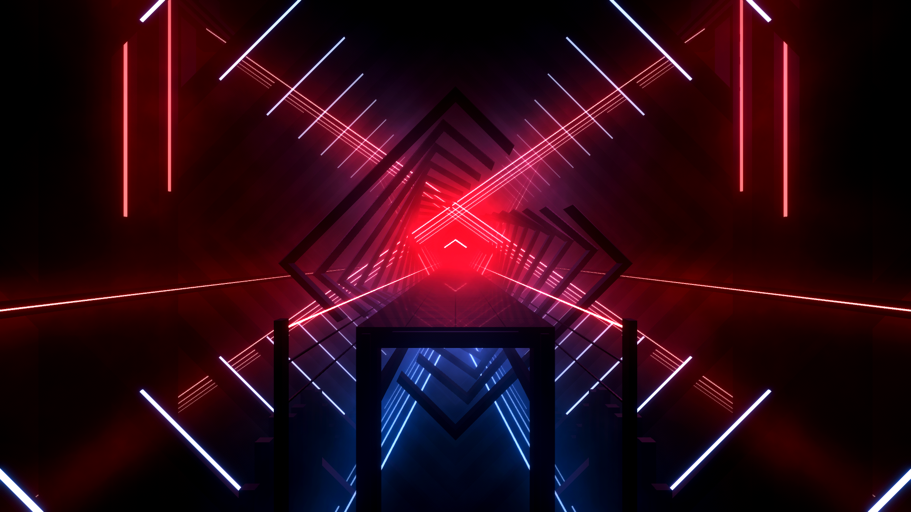 |**The First (Default) Environment**<br />**Info.dat Name:** `DefaultEnvironment` <br />**Default Colors:** Red & Blue<br />**Center Lighting:** :white_check_mark:<BR />**Lasers:** :white_check_mark: (left & right)<br />**Track Ring:** :white_check_mark: (square)<br />**Inner Ring:** :white_check_mark: (square)<br />**Equalizer:** :white_check_mark:<br />**Note:** As of 1.6 Back Top lasers are below the Track Lasers |
|  | **Origins Environment**<br />**Info.dat Name:** `OriginsEnvironment`<br />**Default Colors:** Yellow & Pink notes, Blue & Light Blue lights<br />**Center Lighting:** :white_check_mark:<br />**Lasers:** :white_check_mark:<br />**Track Ring:** :white_check_mark:<br />**Inner Ring:** :x:<br />**Equalizer:** :white_check_mark:  |
| 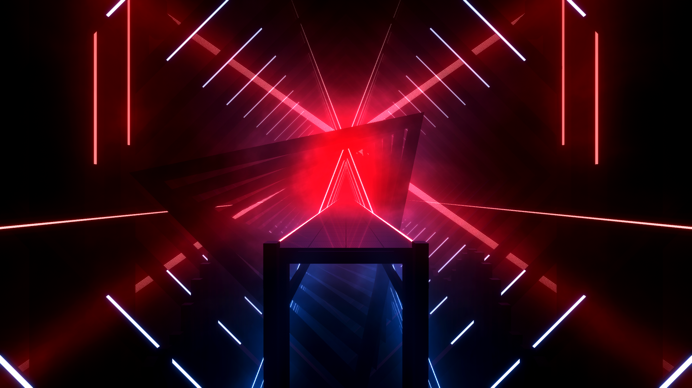 | **Triangle Environment**<br />**Info.dat Name:** `TriangleEnvironment`<br />**Default Colors:** Red & Blue<br />**Center Lighting:** :white_check_mark:<br />**Lasers:** :white_check_mark: (left & right)<br />**Track Ring:** :white_check_mark: (compact square) <br />**Inner Ring:** :white_check_mark: (triangle)<br />**Equalizer:** :white_check_mark:<br />**Note:** As of 1.6 Back Top lasers are below the Track Lasers |
|  | **Nice Environment**<br />**Info.dat Name:** `NiceEnvironment`<br />**Default Colors:** Red & Blue<br />**Center Lighting:** :white_check_mark:<br />**Lasers:** :white_check_mark: (top & bottom)<br />**Track Ring:** :white_check_mark: (circle)<br />**Inner Ring:** :white_check_mark: (shape)<br />**Equalizer:** :white_check_mark:<br />**Note:** As of 1.6 Back Top lasers are below the Track Lasers |
| 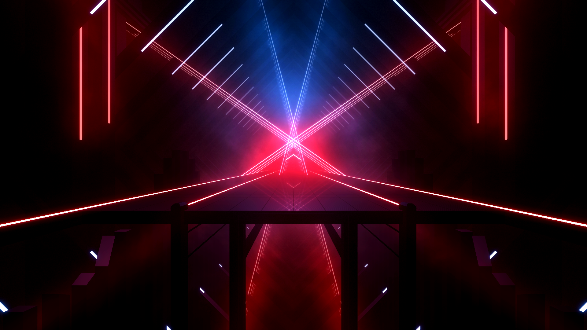 | **Big Mirror Environment**<br />**Info.dat Name:** `BigMirrorEnvironment`<br />**Default Colors:** Red & Blue<br />**Center Lighting:** :white_check_mark:<br />**Lasers:** :white_check_mark: (left & right)<br />**Track Ring:** :white_check_mark: (square)<br />**Inner Ring:** :x:<br />**Equalizer:** :white_check_mark: |
| 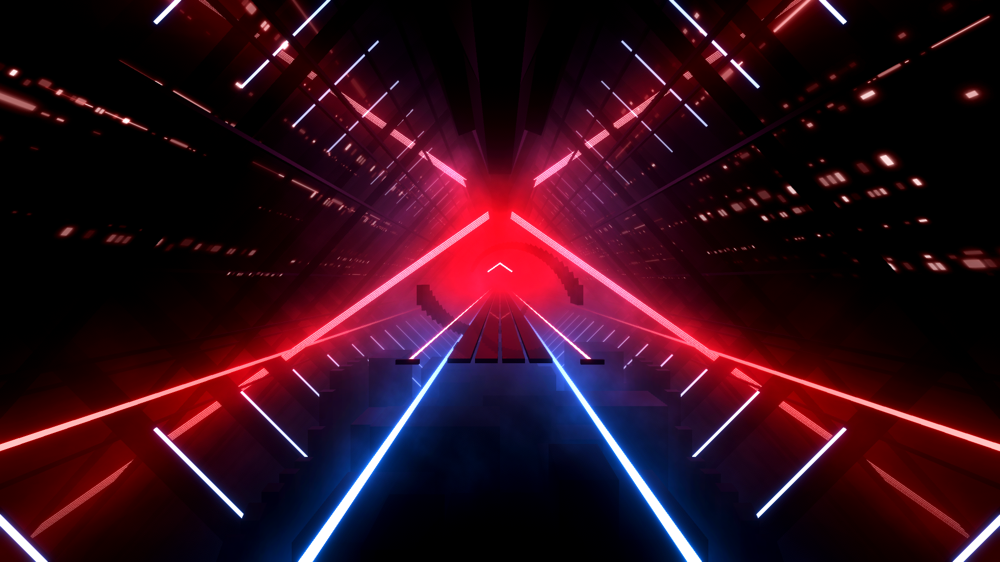 | **Imagine Dragons Environment**<br />**Info.dat Name:** `DragonsEnvironment`<br />**Default Colors:** Red & Blue<br />**Center Lighting:** :white_check_mark:<br />**Lasers:** :white_check_mark: (left & right)<br />**Track Ring:** :white_check_mark: (square)<br />**Inner Ring:** :white_check_mark: (helix)<br />**Equalizer:** :white_check_mark:<br />**Note:** Back Top Laser position is the two rails on the far edges of the screen. It will always illuminate the opposite color of what you set it. |
|  | **K/DA Environment**<br />**Info.dat Name:** `KDAEnvironment`<br />**Default Colors:** Purple & Orange<br />**Center Lighting:** :white_check_mark:<br />**Lasers:** :white_check_mark: (left & right)<br />**Track Ring:** :x:<br />**Inner Ring:** :x:<br />**Equalizer:** :x:<br />**Note:** Ring Light position illuminates the five rails at the top. The lights in the center of the arrows never turn off.|
| 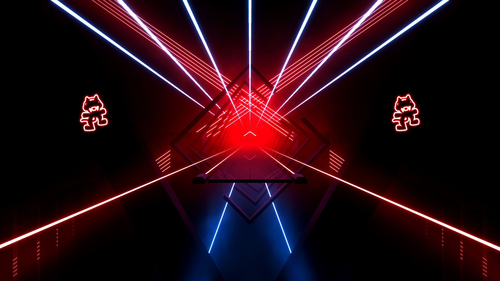 | **Monstercat Environment**<br />**Info.dat Name:** `MonstercatEnvironment`<br />**Default Colors:** Red & Blue<br />**Center Lighting:** :white_check_mark: (& Monstercat Logo)<br />**Lasers:** :white_check_mark: (left & right)<br />**Track Ring:** :x:<br />**Inner Ring:** :white_check_mark: (square)<br />**Equalizer:** :white_check_mark:<br />**Note:** As of 1.6 Back Top lasers are below the Track Lasers. Ring Light position illuminates the five rails at the top. |
|  | **Crab Rave Environment**<br />**Info.dat Name:** `CrabRaveEnvironment`<br />**Default Colors:** Green & Blue<br />**Center Lighting:** :white_check_mark: (& Monstercat Logo)<br />**Lasers:** :white_check_mark: (left & right)<br />**Track Ring:** :x:<br />**Inner Ring:** :white_check_mark: (square)<br />**Equalizer:** :white_check_mark:<br />**Note:** As of 1.6 Back Top lasers are below the Track Lasers. Ring Light position illuminates the five rails at the top. |
| 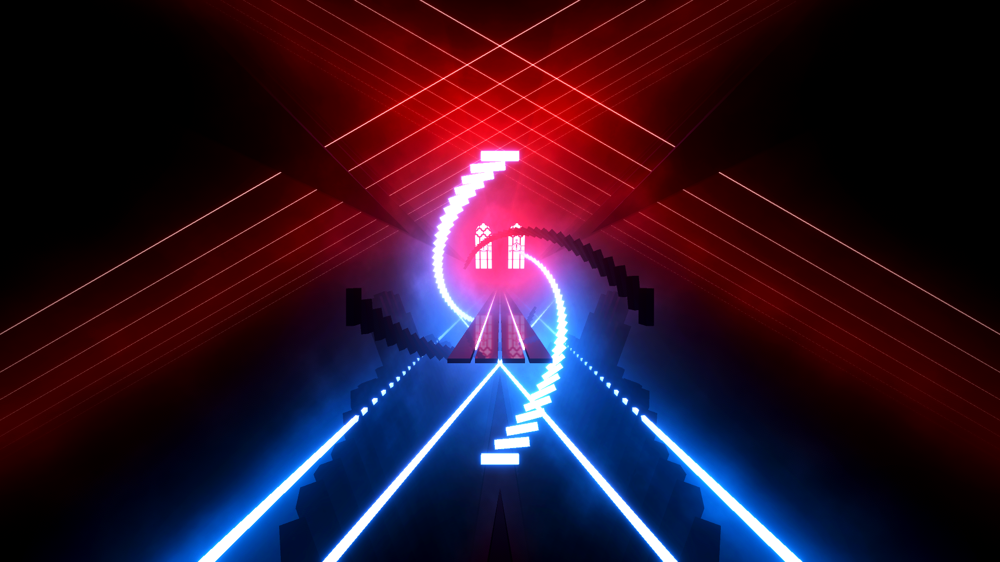 | **Panic at the Disco! Environment**<br />**Info.dat Name:** `PanicEnvironment`<br />**Default Colors:** Red & Blue<br />**Center Lighting:** :white_check_mark: (& windows)<br />**Lasers:** :white_check_mark: (left & right)<br />**Track Ring:** :white_check_mark: (helix)<br />**Inner Ring:** :white_check_mark: (helix)<br />**Equalizer:** :white_check_mark:<br />**Note:** Ring Lights are much brighter in this environment than in others. |
|  | **RocketLeague Environment**<br />**Info.dat Name:** `RocketEnvironment`<br />**Default Colors:** Orange & Blue<br />**Center Lighting:** :white_check_mark:<br />**Lasers:** :white_check_mark: (left & right)<br />**Track Ring:** :x:<br />**Inner Ring:** :x:<br />**Equalizer:** :x:  |
| 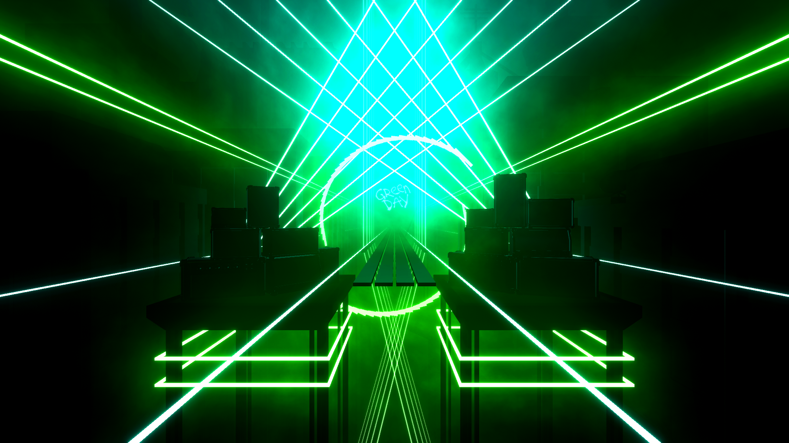 | **Green Day Environment**<br />**Info.dat Name:** `GreenDayEnvironment`<br />**Default Colors:** Green & Cyan<br />**Center Lighting:** :white_check_mark:<br />**Lasers:** :white_check_mark: (left & right)<br />**Track Ring:** :white_check_mark: (helix)<br />**Inner Ring:** :x:<br />**Equalizer:** :x:<br />**Note:** "Green Day" text in the center never turns off. |
| 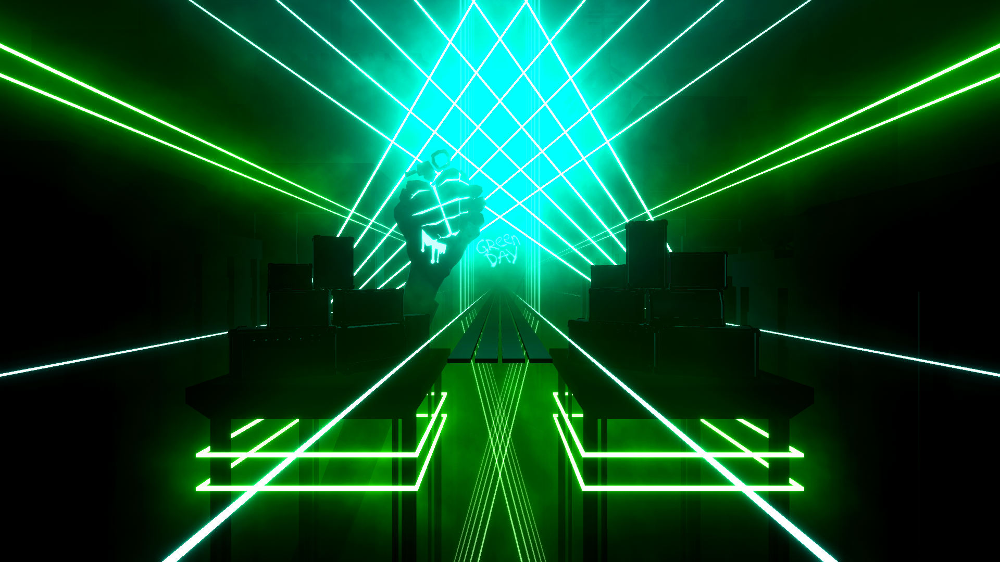 |**Green Day Grenade Environment**<br />**Info.dat Name:** `GreenDayGrenadeEnvironment`<br />**Default Colors:** Green & Cyan<br />**Center Lighting:** :white_check_mark:<br />**Lasers:** :white_check_mark: (left & right)<br />**Track Ring:** :x:<br />**Inner Ring:** :x: <br />**Equalizer:** :x:<br />**Note:** Grenade and "Green Day" text in the center never turns off. |
| 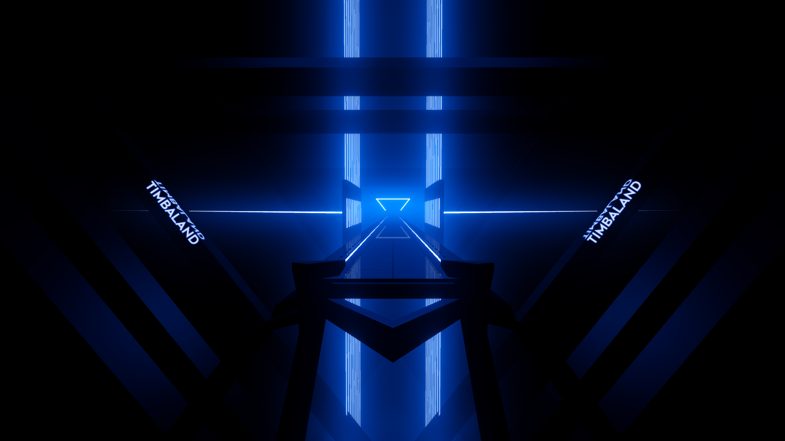 |**Timbaland Environment**<br />**Info.dat Name:** `TimbalandEnvironment`<br />**Default Colors:** Grey & Blue notes, Blue & Blue lights (same colors)<br />**Center Lighting:** :white_check_mark:<br />**Lasers:** :white_check_mark: (left & right rings)<br />**Track Ring:** :white_check_mark: (rectangle)<br />**Inner Ring:** :white_check_mark: (rectangle)<br />**Equalizer:** :white_check_mark:<br />**Note:** "Timbaland" text on the sides never turns off. |
| 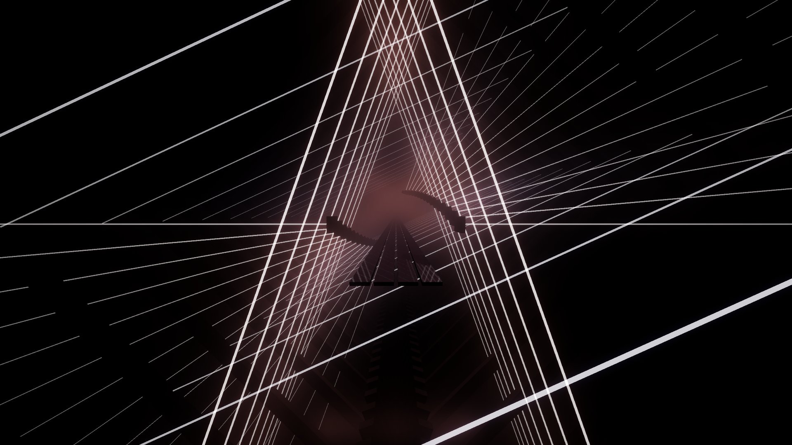 |**FitBeat Environment**<br />**Info.dat Name:** `FitBeatEnvironment`<br />**Default Colors:** Yellow & Pink notes, Brown & Grey lights<br />**Center Lighting:** :white_check_mark:<br />**Lasers:** :white_check_mark: (left & right)<br />**Track Ring:** :white_check_mark: (outer lasers) <br />**Inner Ring:** :white_check_mark: (helix) <br />**Equalizer:** :white_check_mark:<br />|
|  | **Glass Desert Environment**<br />**Info.dat Name:** `GlassDesertEnvironment`<br />**Default Colors:** Red & Blue<br />**Center Lighting:** :white_check_mark:<br />**Lasers:** :white_check_mark: <br />**Track Ring:** :x:<br />**Inner Ring:** :x:<br />**Equalizer:** :white_check_mark:<br />**Note:** This is the first 360&deg; environment. 360 levels MUST use this and it's not useable for standard levels. Ring Light position controls the horizontal outer rail. Back Top Laser position controls the six rails at the top. | 

### Setting Your Environment
New default environments become available reasonably often which means that map editors don't always have the complete list available. If the environment you want to use is not an option in your favorite editor's settings you will have to edit your `info.dat` file to add the environment name.

::: danger
If you choose to add a different default environment to your map via file editing this must be the LAST thing you do before releasing. If you open your map in the editor again the environment will be erased.
:::

1. Decide which environment you want to use then copy the `info.dat name` from the [Environment Previews](/mapping/basic-lighting.html#environment-previews) section above.
2. Open your `info.dat` file in the text editor of your choice.
3. Scroll down to the `"_environmentName":` section.
4. Paste in the name you copied in Step 1.

> **NOTE:** You cannot use a custom platform in this field. This will be covered in Intermediate Lighting (coming soon!)

## Map Color Overrides
You can force your own map color scheme in-game as long as the user has the SongCore mod installed and has enabled the `Enable Custom Song Colors` option in the mod settings.

Since Beat Saber version 1.4, users can set the Red/Green/Blue (RGB) colors of notes, lights, and walls for their game. However, they will be overridden with the colors defined in the `info.dat` if the user has the `Enable Custom Song Colors` option enabled.

:::tip 
When choosing color overrides for the notes. It is **HIGHLY** recommended that you keep reddish/warm colors on the left and blueish/cold colors on the right to avoid confusing players.
:::

[BeatMapper](/mapping/#beatmapper-app) and [ChroMapper](/mapping/#chromapper-coming-soon) natively support color overrides. Check their respective guides for more information.  
[MMA2](/mapping/#mediocre-map-assistant-2) does not support color overrides and requires manual editing of your map files or use of [BeatMapperTools](https://mappers.beatmappertools.com/) by **Darkuni**.

### Manually Adding Color Overrides
1. Decide what RGB colors you want notes and/or lights and/or walls to be. Use a color scheme utility like [Paletton](https://paletton.com/#uid=1000u0kllllaFw0g0qFqFg0w0aF) to find complimentary colors.
	* Your red, green, and blue values will need to be converted from the normal 0-255 scale to the 0-1 scale. Use a site like [EasyRGB](https://www.easyrgb.com/en/convert.php) to convert your values.
2. Open your `info.dat` file in the text editor of your choice
3. Scroll down to the `"_customData": {` section of the difficuty you want to color.
    * Using the global `"_customData": {` outside of the `"_difficultyBeatmapSets": [` array may not work as expected.
4. Paste whichever code blocks below correspond to the colors you want to force within the `_customData` curly brackets (`{` and `}`) then replace the `"r":`, `"g":`, and `"b":` values with whatever you chose in Step 1.
	* The `"r":` and `"g":` values **must** have commas after them.

See lines 29-60 and 69-100 of this [Pastebin clip](https://pastebin.com/x9zEiHxR) for an example of these code blocks in action in a `.DAT` file.

::: danger WARNING for MMA2 Users
If you choose to manualy add color overrides to your map this must be the **LAST** thing you do before releasing.  
Opening your map in the editor again will remove your color overrides.
:::

**Left Side Block Color (default Red)**
```
"_colorLeft": {
  "r": 0.8515625,
  "g": 0.08984375,
  "b": 0.08984375
},
```
**Right Side Block Color (default Blue)**
```
"_colorRight": {
  "r": 0.1796875,
  "g": 0.5390625,
  "b": 0.91015625
},
```
**Left Side Light Color (default Red)**
```
"_envColorLeft": {
  "r": 0.8515625,
  "g": 0.08984375,
  "b": 0.08984375
},
```
**Right Side Light Color (default Blue)**
```
"_envColorRight": {
  "r": 0.1796875,
  "g": 0.5390625,
  "b": 0.91015625
},
```
**Wall Color (default Red)**
```
"_obstacleColor": {
  "r": 1,
  "g": 0,
  "b": 0
 },
```
## Previewing Your Lights
These tools will help PC Beat Saber users preview their lighting more accurately. Most editors do not show true-to-life lighting effects.
 
### In-game with FPFC
First Person Flying Controller (FPFC) is a launch parameter that can be used by either Steam or Oculus users. FPFC will open an instance of Beat Saber on your desktop and allow you to control it with your keyboard and mouse. You will need the [FPFCToggle](https://github.com/DeadlyKitten/FPFCToggle/releases/latest) and [Music Escape](https://github.com/DeadlyKitten/MusicEscape/releases/latest) mods in order to interact while a map is playing. 

**FPFCToggle:** allows you to use WASD to "fly" around in your map.  
**Music Escape:** allows you to open the pause menu by hitting the <kbd>F2</kbd> key or exit your level by hitting the <kbd>ESC</kbd> key (otherwise you must play your song to completion).

**For Steam Users:** Open the game properties and add `fpfc` to the Steam launch options.  
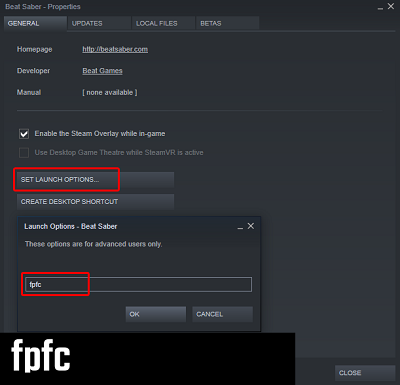

**For Oculus Users:** 
1. Right click on Beat Saber.exe and create a shortcut. 
2. Edit the Target to add "fpfc" to the end of it.
For example: `C:\Program Files\Oculus\Software\Software\hyperbolic-magnetism-beat-saber\Beat Saber.exe" fpfc`

After installing the mods and adding the launch parameter you should then enter a map. You will start on the floor as always but now if you double press the <kbd>G</kbd> key you will be able to move during the song. You can also open the pause menu out by pressing <kbd>Esc</kbd>.

:::warning NOTE
- You may encounter issues if you press the <kbd>G</kbd> key before entering a song.

- If you go back into vr and the game doesn't load in the headset either: 
  - Press the <kbd>G</kbd> key until the headset displays the game  
**==OR==** 
  - Quit the game, remove the launch option, and relaunch the game.

- If the mod doesn't seem to be working, make sure the in-game Smooth Camera setting is disabled. 
:::

### Online with BS Viewer
[BS Viewer](https://skystudioapps.com/bs-viewer/) by **+1 Rabbit** is an online tool that is a convienient way to checkout how your map might look in game without the game. Just upload your map zip to the website and preview! Unfortunately **IOS and Safari are currently not supported.**

## Credits
Content in this section was authored by [LittleAsi](/mapping/mapping-credits.html#littleasi) and [Kolezan](/mapping/mapping-credits.html#kolezan) or derived from guides by [Puds](/mapping/mapping-credits.html#puds) and [MandyNasty](/mapping/mapping-credits.html#mandynasty). 
