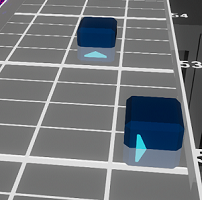

# Intermediate Mapping
_A more in-depth look at many mapping topics_

Mapping is level design. Design is both an art and a science. There is no “best” answer, but there are many “wrong” answers.  
The [Basic Mapping](/mapping/basic-mapping.html) page is useful for learning what not to do as a new mapper. Once you have a bit of experience it’s time to take your understanding of mapping principles to the next level. Ultimately, the best way to learn to map is to simply keep at it.  
  
**Try. Adjust. Listen. Repeat.**

## !Notice! This is a Stub Page
:::warning
This is a stub page, content is a work in progress! Ask in `#mapping-discussion` if you want more info!
:::

## Rule Breaking
Rules are made to be broken. However, they must be thoroughly understood before you can break rules and some have virtually no cases where breaking them is preferred. With experience and [outside](../mapping/#community-third-party-testing) feedback, there is always value to exploring the full design space of beat saber mapping and pushing the limits of the rules.  

Outside feedback is **critical** as the mapper! You know the rhythm and patterns better than any other person and will be ready to perform the motion before the notes ever show up. By getting [third party feedback](../mapping/#community-third-party-testing) on broken rules, such as in the BSMG `#testplays` channel, you can have confidence in your unique patterns and in your map.

## Consistency & Variety
Representing music via consistent note placement when there are similarities in the music and varying mapping when there changes in music are core techniques of intermediate mapping.

1. **Representation** is tied to music that your notes are following.  
At the basic level, the sounds that are mapped within each section should follow some kind of rule, such as following an instrument. You can get more complicated, such as mapping the left hand to drums, and the right hand to vocals, but there should be a rule for the mapping within each section.

2. **Consistency** and **Variety** come into play in two places, within a section and when comparing separate sections of a song.  
    1. Within a section, representation rhythm-wise should generally stay consistent as it allows players to establish that rhythm and enjoy the map. Being consistent with patterns is acceptable as well, but some variety of note placements within the bounds of the established patterns and rhythms is appreciated.
    2. Consistency and variety are more important when comparing sections of a song, as properly varying your mapping between sections will help the song shine via the map.  
    3. Repeated sections of music should play similarly, and contrasting sections should play differently. The degree of this contrast is up to the mapper.  
        * This does not mean that the exact same patterns need to be used, but players should be able to feel the similarities between sections with similar music. This can be done in a variety of ways, primarily it is achieved by mapping the same rhythms. If you choose to map a different rhythm, using similar patterns and motions will provide a similar effect.
    4. Varying the mapping appropriately when the music changes is also important. When a change in the music happens, the effect is a lot stronger when the change is reflected in the mapping.

If you’d like to explore this more in depth, checkout [pishifat's video](https://www.youtube.com/watch?v=Z7IY0gDwSQo) on mapping variety in osu!. While it is an osu! video, the concepts translate over to Beat Saber mapping quite well.

## Emphasis
While big towers, windows, doubles, fast jumps, and fast streams are fun. Consider whether the patterns being mapped reflect the intensity level of the music. 
  1. Within a section, the most prominent sounds should be emphasized more, and the less prominent less emphasized. Emphasis can be done in a variety of ways, such as:
      * Spacing notes further apart to induce bigger swings.
      * Adding doubles and stacks for oomph.
      * Mapping faster rhythms to induce faster swinging.
      * Not mapping less significant sounds or segments so the more important sounds or segments stand out more.
  2. The intensity of the mapping in each section relative to other sections should be somewhat in line with the intensity of the music. Try to rate the intensity of each section in your map from 1-10 and see if it lines up with the intensity you feel from the song.
  3. Deviation from the intensity of the music is fine as long as sections are not excessively elevated or lowered relative to the intensity of the rest of the song. An example would be fully mapping very quiet 1/4 drums when the rest of the map is mapped to 1/1 or 1/2 would unnecessarily elevate it in intensity above the rest of the song.

If you want to explore this more in depth, checkout [pishifat's video](https://www.youtube.com/watch?v=rAYm50d6XMw) on osu! spacing emphasis. While it is an osu! video, the concepts do translate to intensity in Beat Saber.

## Visibility
Players need to see the notes to comfortably prepare and react. Notes that are hidden until the last second are very jarring to play.

### Vision Blocks
Speed influences visibility heavily, as the note jump speed and spawn distance dictate how much time the player has to see incoming notes. The player will have too little time to react to notes that spawn too close and approach too quickly. Likewise, vision blocks are more severe as the song gets faster- when the note exists for a shorter time, any time that the block is obscured is more impactful. At extreme speeds and slower note jump speeds, even bottom row blocks can obscure other bottom row notes (the same can be said for top row notes, but those are rarely used at a density where this is a problem).

### Note Jump Speed & Spawn Distance
Note Jump Speed (NJS), Spawn Offset (or offset), and Spawn Distance are additional factors you need to consider for visibility. 

Slower NJS is useful for visibility on easier songs where players need to see things coming to react. Faster NJS is useful for fast songs which would otherwise appear cluttered without note spacing. Faster NJS also helps for visually cluttered maps which heavily use elements such as bombs or sliders that otherwise create visual noise. 

Larger spawn distances are good for maps which need high visibility to catch unusual or large motions such as dancey maps. Shorter spawn distances are useful for maps which have simpler patterns but are faster- a shorter spawn distance means that fewer notes are on screen, therefore being less cluttered. 

Offset is used to adjust a song’s spawn distance while keeping the NJS the same, since spawn distance varies with NJS and BPM. Spawn offsets can be positive or negative and usually don't go above 1 or below -1. Below is a table of NJS, spawn offset, and spawn distance values that can be used as a guide (but not as law) for determining your map’s parameters. Using this table, adjust the offset as needed to reach the target spawn distance.

| **Speed & Style** | **Spawn Distance Target** | **Expert NJS** | **Expert+ NJS** |
|:----:|:----:|:----:|:----:|
| Slow (< 100 BPM) Standard | 24-27 | 14-16 | 18 |
| Slow (< 100 BPM) Dancey | 25-28 | 13-15 | 16-18 |
| Average (100 - 160 BPM) Standard | 24-27 | 15-16 | 17-20 |
| Average (100 - 160 BPM) Dancey | 25-28 | 14-17 | 16-18 |
| Fast (> 160 BPM) Standard | 23-27 | 16-17 | 17-20 |
| Ultrafast (> 200 BPM) Standard | 23-25 | 18-21 | 19-24 |

## Understanding Flow
In [Basic Mapping](../mapping/basic-mapping.md#do-mapping-with-flow) we covered the bare essentials of parity. Now we’ll dig deeper and explore why some hits just feel bad.  

Flow is arguably the most important concept in mapping - how each arm travels to move from one hit to the next. This can be as simple as alternating between “forehand” and “backhand” notes, or as complicated as thinking about how one arm interacts with the other at the edges of the playspace. Since the player must see blocks in order to react to them, flow highly depends on speed and difficulty. Slower songs are far more forgiving and flexible with regards to flow, while a fast song is highly limited.

### Block Directions & Positions
Each swing a player makes leaves their arm in a new position. At hard difficulty and higher, the player will leave their arms in this new position while waiting for the next motion. The block that follows must consider the position of the arm.

| **Poor Positioning** | **Poor Angles** | **Good Position & Angle** |
|:----:|:----:|:----:|
| *Picture Here Soon* | *Picture Here Soon* | *Picture Here Soon* |
| You can see here that the arm is not ready to hid down from the position it is left in.| In order to hit the next block, the arm has to do a lot of extra motion to wind up. | Taking both into consideration, you are left with a smooth motion. |

* Each block has a limited selection of following blocks that feel good to play. 
* It takes longer wind up for less optimal hits and more suggested motion to play be it from another block, bombs, or walls. 
* Faster songs have less time to see and comprehend the next block, leaving the mapper with more limited options for patterns. Vision blocking notes/walls are risky for this same reason.
* Counter-clockwise wrist motions are preferred with the right hand and clockwise wrist motions are preferred with the left hand. Try it yourself and feel the difference!

Sorted by how awkward they are for the right hand, left being the most awkward and right being the least. Note that this is mirrored for the left hand (Red Notes).  
**Awkward Backhands:**     
**Questionable Backhands:**   
**Awkward Forehands:**      

If you have to make either a double backhand/forehand or one of the awkward backhands/forehands, the result is a DD or a triangle pattern.

### Suggested vs. Required Motion
When mapping unusual patterns that break typical conventions for flow, extra motion is suggested to make the pattern work.   
An example is a scoop:   
In order to hit the up note following the side note, the arm must take a longer scooping path to be in position. This motion is suggested, where an extra note block down would require the motion instead.

Suggested motion is risky due to the fact that players will read and react to patterns differently than intended. One player may hit a scoop as intended, but another player may recoil and flinch given the pattern and have a negative experience from the pattern. This problem can never be entirely avoided when suggesting motion rather than requiring. Clever use of bombs, walls, or crossovers can help suggest more strongly the intended motion, but must be used with care to avoid vision, tangle, or flow issues.

#### Soft Resets
Soft resets are resets where implied motion strongly suggests resetting the hand. The most common example of this is a half-double, present in many maps. This is where a down double followed by a single up followed by a down double, where its implied that both arms should raise on the single up despite only 1 note being there. 

While these patterns allow for more freeform dancey motion, they are very difficult to sightread and throw the player off of their natural rhythm. This is due to the fact that only one of the two hands on a soft reset feels the haptic feedback of slashing a note. These are best used when the player is familiar with the rhythm and motion, and requires a large offset to see them approaching. 

### Arm Tangles
Arm tangles happen when a pattern requires one arm to swing through another arm’s spot. Care must be taken to ensure that crossovers at risk of tangling are either kept above/below the other arm, or returned to their side before the other arm’s next hit.

Slower maps typically reward dancier and larger arm motions, causing arm tangles to have a stronger negative impact. On the other hand, faster maps typically are hit with less full-arm motion and can cheat arm tangles by having just the tip of the saber hit crossovers.

### Crossovers
Crossovers happen when one arm swings to the opposite side of the playspace. This is a challenging motion reserved for harder difficulties or slower maps. Crossovers open up the playspace for many interesting patterns so long as they are handled with care.  

When swinging far from the natural position of the arms, bad flow is more pronounced. Additionally, the risk of arm tangles arises when crossovers do not consider the positions of notes to unwind the player during or after the sequence.

## Spacing
Spacing is the distance between notes on the grid. The further apart two notes are on the grid (ignoring time), the larger the spacing. In general, larger spacing requires larger motions to hit and requires either larger arm motion or very precise wrist motion. Spacing is larger horizontally than vertically due to the extra rows. Inverted notes (up arrows in the bottom row and down arrows in the top row) create the largest spacing due to the fact that the player must swing from outside the grid to hit these blocks.

## Walls
Walls are a versatile tool in maps that are often overlooked. They provide the most direct way to influence full body motion, as well as an immersive visual element. Overuse/misuse can lead to visual clutter or full vision blocking- so care must be taken. Treat any wall placed in either of the middle two lanes as a vision block for that lane, as they block the same (if not more) space. Additionally, walls placed in both middle lanes at the same time are never acceptable - most players cannot safely move out of the way within their playspace. Even players who are able to dodge these walls will not enjoy the amount of movement required.

### Moving the Player with Walls
Walls are a way to encourage the player to move left, right, down, or a combination of the three while playing. They are extremely powerful at doing this since players cannot touch them for too long.

#### Dodge Walls
Left and right movement should feel natural and never be forced
  * The note pattern should already encourage the player to move in that direction.
  * There should be enough space between walls if using left/right back to back.
    * Often 1 beat between the end of one and the start of next is enough. Though depending on the BPM more space is required.
  * Groove Walls are a situational exception to this but, are hard to execute correctly.

#### Crouch Walls
Down movement is trickier as it is easier to do more harm than good
  * Most players dislike crouch walls, be very selective when using them
    * Crouch walls should be avoided when the spawn distance is very short and NJS is high as they make even fully telegraphed crouch walls too fast to react to.
  * Keep them short, there’s rarely a good reason to have them longer than 1-2 beats
  * If you are ending a crouch wall with notes just after, be extremely careful with what direction you start (up/down)
    * Starting down too quickly is uncomfortable and almost always unnecessary. 
    * Starting up too late is also awkward
  * It is easy to justify a crouch wall if the lyrics in a song say “down”, “under”, or any other reference to a downward motion
  * Side notes are more natural to hit while under a crouch wall than up/down notes
  * It is better to have a crouch wall end early than late as it plays better for any player in general. Especially those who have physical trouble crouching for too long. 
      * If your crouch wall is longer than 1 beat, shorten it by 0.5
      * If less than 1 beat and greater than 0.5, shorten by 0.25
      * Otherwise, leave it

### Aesthetic Walls
These walls are one option for adding a visual element to the map close to the player. They narrow down the field to a smaller region, making notes feel closer together and faster approaching. They can also be used to represent sounds not mapped by notes, or even used to flesh out quiet/slow/vocal drifting sections. 

Using Mapping or Noodle Extensions opens up a huge space of possibilities by allowing walls to be of almost any height, width, and location but, requires a significantly larger amount of effort and is not playable without the respective mod. See [Extended Mapping](/mapping/extended-mapping.md#wall-mapping) for more info.

## Bombs
The opposite of notes, bombs count as misses when they are hit. This opens up more opportunities for patterns, but have significant limitations. Notes specify the direction, timing, and hand all in one block. Bombs, on the other hand, have very little limitation imposed on the player. 

Just as notes are placed with flow in mind, bombs should be placed as well! Bombs located where the sabers will be after swinging will not flow well due to the abrupt motion required to avoid it. Bombs placed at the same time as notes are particularly limiting as they either will restrict the swing path or offer little value to the map other than decoration.

Note that since bombs do not strictly define any motion, different players will approach bomb patterns with different motions. Care must be taken to ensure bomb patterns are easy to read and smooth to play, otherwise they will cause frustration. 

As a result, bombs are not often used in maps other than for bomb resets. Bomb resets are a way to reset both hands to the same direction, but if used too quickly will feel abrupt and uncomfortable. This can be remedied by having notes immediately before the bomb reset guide the player to resetting more smoothly.

## Sliders
Sliders are the use of multiple notes at different times all hit with the same swing.
They fit well for sounds that are sustained for slightly longer than a normal note, but have significant restrictions. 

Conventionally, sliders are started with an arrow block and followed with dot blocks spaced at 1/12 or 1/16 from the original block. Sliders slower than these precisions require the player to alter their swing speed to successfully hit, which is not desired. Sliders faster than these precisions are essentially stacks/towers. 

The using 1/12 vs. 1/16 precision depends on bpm though 1/16 is a safe choice for most speeds. **It is more important for sliders to be playable than to match with the rhythm.** If a 1/8 sound is mapped with 1/8 sliders, it may be too slow to play comfortably in one swing.

Note that there are directions that work more comfortably than others. Namely, sliders should travel clockwise for the left hand, and counterclockwise for the right hand. Sliders are almost always restricted to 3 notes or less, as changing directions mid-slider is extremely difficult to score well on. Sliders that end in the opposite lane (Such as left (Red) sliders ending in the rightmost lane) are easy to miss.

Sliders can also cause significant vision blocks when use in bulk even if the center two positions are not used due to how much visual space the dots fill. Window sliders (3-note sliders that omit the center note) can be used to avoid face notes and clear up vision, but risk being hard to read.

## Single Saber/Handedness Switches
Alternating the hand leading a pattern can be highly effective at providing variety, interesting motions, or unique rhythms but have limitations.  

Typically the player expects patterns to be in the sequence of:   
 To >  To >  To >   
Deviating from this can allow for unique motions and crossovers without tangling, but risks being challenging to read or play at higher speeds. For example if done mid-pattern, it requires one hand to flick twice as fast. While this might not be an issue for slower patterns, faster ones with less visibility or more aggressive motions can be problematic.

## Reading vs. Reacting to Notes
Fundamentally, the player needs to know how to swing in order to follow notes. As speeds increase, the time to read, process, and move accordingly decreases. This is tempered by following convention at higher speeds, such as following the alternating hand sequence as mentioned in the previous section. 

Triangles, switch-ups, unexpected doubles, bombs, walls, etc. can all throw off the expected “reaction” the player will have to incoming notes. This is the reason why offset is so important to consider as dancey, slower patterns need extra time to read and process what approaches while faster songs must keep the screen less cluttered to allow players to follow instinct.

## High Speed Mapping
Playstyle slowly changes as the map reaches extreme speeds (around 200+ BPM). For slower songs, it is easier to perform large arm swings and contort the whole body to hit more unusual patterns. While at high speeds, there is very little time to process what approaches and the game becomes a combination of instinct, precision, and stamina. Patterns and placement gets more and more limited, and visibility becomes of the essence. 

Hidden blocks will be virtually invisible at extreme speeds due to the short amount of time that blocks remain on screen. Inlines, 2-column streams, hitbox-abusing patterns, and large spacing one-handed jumps all become exponentially more problematic as speeds approach extreme speeds. Other, normally innocuous patterns also become challenging including double spam, complex streams, wide hits, and sliders. 

While mapping, it is recommended to slow down playback speed of the song to time notes to the song as accurately as possible.

## Variable BPM Songs
::: tip NOTE
This is a stub section. If you’d like to contribute, submit suggestions via [this form](https://docs.google.com/forms/d/e/1FAIpQLSfVS6_EMZOujxthR3lTa2eEwHg5C3x1INouLgnbHhBDpv1M5A/viewform).
:::  
## Downmapping
::: tip NOTE
This is a stub section. If you’d like to contribute, submit suggestions via [this form](https://docs.google.com/forms/d/e/1FAIpQLSfVS6_EMZOujxthR3lTa2eEwHg5C3x1INouLgnbHhBDpv1M5A/viewform).
:::  

## Swing In a Song and How Shuffle Helps
::: tip NOTE
This is a stub section. If you’d like to contribute, submit suggestions via [this form](https://docs.google.com/forms/d/e/1FAIpQLSfVS6_EMZOujxthR3lTa2eEwHg5C3x1INouLgnbHhBDpv1M5A/viewform).
:::  
See this guide by Sykes [What swing is, and how "shuffle" will make your mapping easier
](https://docs.google.com/document/d/1j7w1X-0QtnJDFVKzyyQc_KR7RE9H3C3JFesIXGR0s1c/edit) on how to use the built in shuffle feature to make mapping songs that have swing easier.

## Credits
Content in this section was authored by [Checkthepan](/mapping/mapping-credits.html#checkthepan), [CyanSnow](/mapping/mapping-credits.html#cyansnow), [Uninstaller](/mapping/mapping-credits.html#uninstaller), [Skyler Wallace](/mapping/mapping-credits.html#skyler-wallace), [Kolezan](/mapping/mapping-credits.html#kolezan), and [DarkGrisen](/mapping/mapping-credits.html#darkgrisen).
