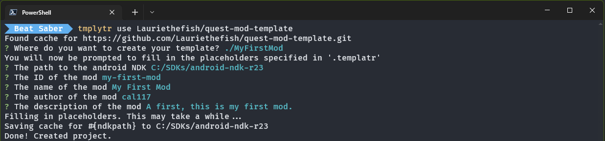
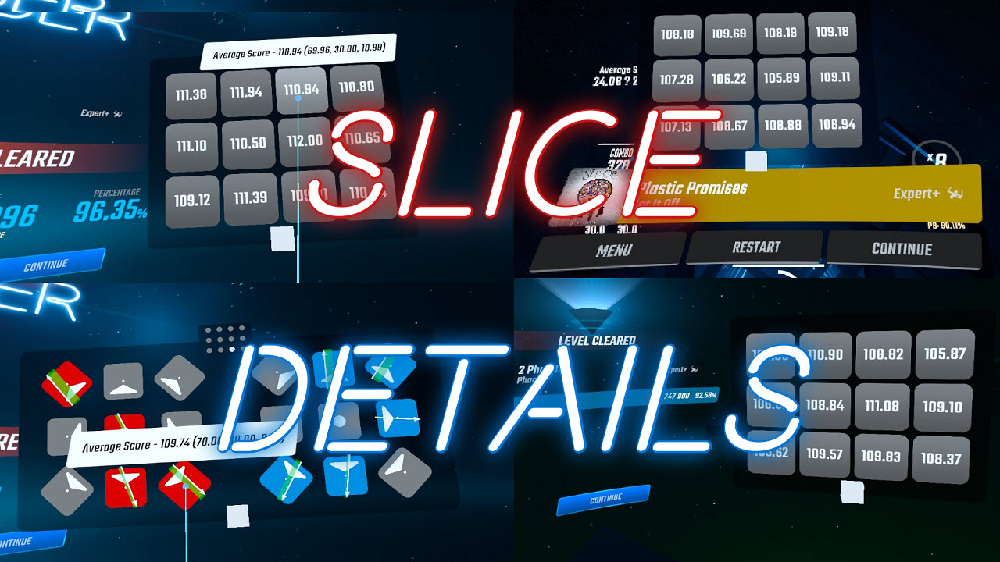

# Quest Mod Development Intro

_Learn how to get started writing your own Quest Mods._

## Getting Started

::: warning
This guide is for making mods for the **Quest Standalone** version of Beat Saber!

If you use Oculus Link or similar, you want to visit the [PC Mod Development Guide](../pc/intro.md) as that uses
the PC version of the game.
:::

This guide assumes you have a basic to intermediate understanding of the following:

- [C++](https://www.w3schools.com/CPP/default.asp)
- [CMake](https://cmake.org/cmake/help/latest/guide/tutorial/index.html)
- [ADB](https://developer.android.com/studio/command-line/adb)
- [Powershell](https://docs.microsoft.com/en-us/learn/modules/introduction-to-powershell/)

You may have difficulty understanding what is covered here if you do not have this foundation.

While this guide is for development on Windows, it is not dependent on an IDE. Instead you should configure your preferred
IDE accordingly by referring to the documentation. For example, you would need to install C++ tools for VSCode or configure
CMake for CLion.

## Environment Setup

The following pieces of software are needed to follow this guide.

- [Powershell](#powershell-core) - Cross Platform utility scripts
- [CMake](#cmake) - Build Automation
- [QPM](#qpm) - Dependency Management
- [Ninja](#ninja) - Build Tool
- [Android NDK](#android-ndk) - Native Development Kit for Android Devices

### Powershell Core

::: warning
You must download Powershell Core, the default windows Powershell will _not_ work.
:::

[Download the latest Powershell binary for your system](https://github.com/PowerShell/PowerShell/releases/latest) and add
it to your PATH variable, or
alternatively download and run the windows installer.

### CMake

[Download the latest CMake binary for your system](https://cmake.org/download/) and add it to your PATH variable, or
alternatively download and run the windows installer.

### QPM

[Download the latest QPM binary for your system](https://github.com/QuestPackageManager/QPM.CLI) from the
Actions tab, name it qpm.exe, and add it to your PATH variable, or alternatively download and run the Windows installer
from the appropriate workflow.

### Ninja

Download ninja via qpm using `qpm download ninja`.

Alternatively you can [Download the latest Ninja binary for your system](https://github.com/ninja-build/ninja/releases)
from the Releases tab
and add it to your PATH variable.

### Android NDK

Download the Andoid NDK via qpm using `qpm ndk download 27`, and add the extracted directory to a new environment variable
called ANDROID_NDK_HOME.

Alternatively you can run `qpm ndk pin 27` in a project directory to only apply the NDK in the current project.

If you wish you can instead download the NDK manually from the [Android NDK Downloads page](https://developer.android.com/ndk/downloads).

## Create a Project

Once you have setup your environment you can now generate a mod template. The template this guide uses is one by
[Lauriethefish](https://github.com/Lauriethefish/quest-mod-template). To start run the following command in Powershell.

```powershell
qpm templatr --git https://github.com/Lauriethefish/quest-mod-template.git <destination>
```

Templatr will then ask a series of questions to create a mod project.



### Add and Update Dependencies

Once the project has been generated, you should now update the following two dependencies, [beatsaber-hook](https://github.com/QuestPackageManager/beatsaber-hook/)
and [bs-cordl](https://github.com/QuestPackageManager/bs-cordl), to the version best suited for the game version you are
developing for.

`beatsaber-hook` is a library that allows for modding il2cpp games. `bs-cordl` is a library that allows modders to
interface with the game's code.

To update these, open a Powershell terminal in the project directory then run the following commands to add the latest versions:

```powershell
qpm dependency add beatsaber-hook
qpm dependency add bs-cordl
```

If the latest versions do match those for the version you are developing for, add `-v ^x.x.x` after the command with the
correct version instead of running those commands. For example, for Beat Saber version 1.35.0, the correct codegen
version is 3500.0.0:

```powershell
qpm dependency add bs-cordl -v ^3500.0.0
```

### Restore Dependencies

Before you can open the project in an IDE, you must restore all of the dependencies. Consider this step similar to
fully initializing the project.

In a Powershell terminal in the project directory run:

```powershell
qpm restore
```

## Project Contents

Your project should contain the following structure:

```properties
// Files in .gitignore have been excluded
cmake/
└── ... project cmake files
extern/
└── ... dependencies should be here
include/
└── main.hpp
scripts/
└── ... utility scripts
shared
src/
└── main.cpp
.gitignore
CMakeLists.txt
mod.template.json
qpm.json
README.md
```

### Code Breakdown

#### src/main.cpp

`main.cpp` contains the `setup()` and `late_load()` methods. These methods can exist in any source file as long as they are
accessible by the modloader. Take a look inside of `main.cpp` for more information as Laurie has thankfully commented
most of the code.

#### shared

The shared folder can be exposed by QPM to other mods and published to the QPM dependency registry. Useful if you want
to make an API to let other mods control your mod in certain ways (for example Qosmetics has a model loading API).
Speak to @Sc2ad if you want to publish something.

#### extern

The extern folder should be ignored (and/or in some cases excluded). It contains dependencies, similarly to
`node_modules` (nodejs) or `packages` (.net core).

### Script Breakdown

It is recommended to run these scripts using Powershell Core (v7) - however, it is not required. All scripts can be run
with the `--help` argument for a description of arguments and functionality. Scripts can be manually invoked from the
`scripts` folder or via qpm scripts inside `qpm.json`

#### build.ps1

Usage: `qpm s build`

Builds your mod. Does not produce a QMOD file.

#### copy.ps1

Usage: `qpm s copy`

Builds your mod, then copies it to your quest and launches Beat Saber if your quest is connected with ADB.

#### createqmod.ps1

Usage: `qpm s qmod`

Generates a QMOD file that can be parsed by BMBF and or QuestPatcher. Will use the most recently built version of your mod.

#### pull-tombstone.ps1

Usage: `qpm s tomb`

Finds the most recently modified Beat Saber crash tombstone and copies it to your device. If the build on your quest matches
what you have most recently built locally, the `-analyze` argument can be provided to generate the source file locations
of any lines mentioned in the backtrace.

#### restart-game.ps1

Usage: `qpm s restart`

Closes and reopens Beat Saber on your quest if it is connected. Mostly used inside of `copy.ps1`. Does not have help text.

#### start-logging.ps1

Usage: `qpm s logcat`

Prints logs from Beat Saber, just your mod, or also crashes. Usage of `-self` is recommended.

#### validate-modjson.ps1

Usage: `qpm s validate`

Generates a `mod.json` from `mod.template.json` if not present and verifies it against the QMOD schema. Mostly used
inside of `createqmod.ps1`. Does not have help text.

## Hooking

Hooking is core to modding. `beatsaber-hook` provides a simple way of hooking methods and other miscellaneous stuff
like constructors.

> In computer programming, the term hooking covers a range of techniques used to alter or augment the behavior of an
> operating system, of applications, or of other software components by intercepting function calls or messages or events
> passed between software components. Code that handles such intercepted function calls, events or messages is called a hook.
> [Wikipedia](https://en.wikipedia.org/wiki/Hooking#:~:text=In%20computer%20programming%2C%20the%20term,events%20passed%20between%20software%20components.&text=Hooking%20can%20also%20be%20used%20by%20malicious%20code.)

To view a list of methods and classes you can hook, the most convenient option is to use a C# decompiler such as [IlSpy](https://github.com/icsharpcode/ILSpy)
if you own the game on PC, as it provides not only the classes and member names, but also the full contents of most methods.
If you only own the game on the Quest, then you can still view all the classes and methods in the `includes/codegen`
directory in your `extern` folder.

In this example, we will hook onto the initialization of the level screen and change the text on the play button to
something funny.

The level screen runs the event `DidActivate` when it is fully initialized. This is useful for us because we can hook
this event and add our own functionality.

Firstly, create your hook using the `MAKE_HOOK_MATCH` macro:

<!-- markdownlint-disable MD013 -->

```cpp
// You can think of these as C# - using HMUI, UnityEngine, etc, but with individual classes
// Classes without a namespace are assigned to the GlobalNamespace
// If you use a class and do not include it, you may get unclear compiler errors, so make sure to include what you use
#include "GlobalNamespace/StandardLevelDetailView.hpp"
#include "GlobalNamespace/StandardLevelDetailViewController.hpp"
#include "UnityEngine/UI/Button.hpp"
#include "UnityEngine/GameObject.hpp"
#include "HMUI/CurvedTextMeshPro.hpp"

// Create a hook struct named LevelUIHook
// targeting the method "StandardLevelDetailViewController::DidActivate", which takes the following arguments:
// bool firstActivation, bool addedToHierarchy, bool screenSystemEnabling
// and returns void.

// General format: MAKE_HOOK_MATCH(hook name, hooked method, method return type, method class pointer, arguments...) {
//     HookName(self, arguments...);
//     your code here
// }


MAKE_HOOK_MATCH(LevelUIHook, &GlobalNamespace::StandardLevelDetailViewController::DidActivate, void,
 GlobalNamespace::StandardLevelDetailViewController* self, bool firstActivation, bool addedToHierarchy, bool screenSystemEnabling) {
    // Run the original method before our code.
    // Note that you can run the original method after our code or even in the middle
    // if you want to change arguments or do something before it runs.
    LevelUIHook(self, firstActivation, addedToHierarchy, screenSystemEnabling);

    // Get the actionButton text object by accessing the actionButton field and some simple Unity methods.
    // Note that auto can be used instead of declaring the full type in many cases.
    GlobalNamespace::StandardLevelDetailView* standardLevelDetailView = self->_standardLevelDetailView;
    UnityEngine::UI::Button* actionButton = standardLevelDetailView->actionButton;
    UnityEngine::GameObject* gameObject = actionButton->get_gameObject();
    HMUI::CurvedTextMeshPro* actionButtonText = gameObject->GetComponentInChildren<HMUI::CurvedTextMeshPro*>();

    // Set the text to "Skill Issue"
    actionButtonText->set_text("Skill Issue");
}
```

<!-- markdownlint-enable MD013 -->

Now, you have to install your hook. Usually, hooks are installed in `load()` or `late_load()` in `main.cpp`:

```cpp
MOD_EXTERN_FUNC void late_load() {
    il2cpp_functions::Init();

    PaperLogger.info("Installing hooks...");

    INSTALL_HOOK(PaperLogger, LevelUIHook);

    PaperLogger.info("Installed all hooks!");
}
```

You can now test to see if this was successful!

## Testing your Mod

### Without BMBF

You can test your mod without BMBF quickly using [`copy.ps1`](#copy-ps1). This is recommended while developing
for convenience. You should always test using a QMOD and BMBF if you're about to release your mod.

What[`copy.ps1`](#copy-ps1) does specifically is copy the `libmodname.so` in the `build` folder to the correct place on your
quest and then restart Beat Saber for you. You can also specify while launching to collect logs with the `-log` argument
followed by any of the arguments supported by the `start-logging.ps1` script:

```powershell
copy.ps1 -log -self -file latest.log
```

### With BMBF

Testing your mod with BMBF is useful to make sure BMBF shows and handles your QMOD correctly (copying files,
version, cover, etc.)

You will need to generate a QMOD file using [`createqmod.ps1`](#createqmod-ps1).

You can then upload the generated QMOD file to BMBF and it should install your mod - it should appear on the mods list.

You can still collect logs from your mod using the [`start-logging.ps1`](#start-logging-ps1) command after you launch
the game.

## Utilizing `mod.template.json`

`mod.template.json` contains basic information on your mod. It can also allow you to define other features such as:

- Cover Image (the preview image shown on the BMBF Mods tab)
- File Copies (extract files from the QMOD to a location on the quest device)

Some fields in it will be of the form `${x}` - those will be automatically filled by QPM based on the information in
your `qpm.json` and written to the file `mod.json`. It's not recommended to edit the `mod.json` manually, and it can be
updated at any time by running the command `qpm qmod build` (which only creates the `mod.json` file, not the QMOD itself.)

### Cover Image

A cover image is used by certain mods and BMBF to show a preview of your mod.

To add a cover image, simply name the image `cover.png`, put it in your project directory, and add the following to your
`mod.template.json`:

```json
"coverImage": "cover.png"
```

:::tip Cover Image Recommendations

- 1024x512 (BMBF will resize/crop the image to be this size)
- File format either png, jpg or gif
- Under 2mb to prevent load lag (larger images will take longer to show with no advantage)
  :::

#### Example Cover Images

Click on the arrow beside the mod name to see the image.

<details><summary>
Noodle Extensions
</summary>


</details>
<details><summary>
Slice Details Quest
</summary>



</details>

### File Copies

File copies is an array that can specify extra files in your QMOD to be copied to the quest, such as sabers included by
default in Qosmetics. You can add files by editing `createqmod.ps1` and `mod.template.json`.

#### Example

This example will add `secret-data.json` to the QMOD and copy it to `/sdcard/ModData/com.beatgames.beatsaber/Mods/Secret/secret-data.json`

Edit [createqmod.ps1](#createqmod-ps1) to include `secret-data.json`:

```powershell
# This is after line 59 of createqmod.ps1
$filelist += "/path/to/secret-data.json"
```

Update the following in your `mod.template.json`:

```json
"fileCopies": [
    {
        "name": "secret-data.json",
        "destination": "/sdcard/ModData/com.beatgames.beatsaber/Mods/Secret/secret-data.json"
    }
]
```

## Mod Configuration

Most mods require a configuration to allow users to change the functionality of the mod.

Visit the [Quest Mod Configuration](./config.md) page to learn the basics of using `config-utils` to create
a configuration for your mod.

## Custom Types

`custom-types` is a library that allows you to create the equivalent of C# types using macros. These types can extend
classes such as `MonoBehaviour` and much more. `custom-types` also allows you to create and use [coroutines](https://docs.unity3d.com/Manual/Coroutines.html)
and [delegates](https://learn.microsoft.com/en-us/dotnet/csharp/programming-guide/delegates/).

Custom Types are complex and requires knowledge of basic C#. Visit the [Quest Custom Types](./custom-types.md)
page to learn more about integrating this into your mod.

## User Interface

A user interface (UI) is used by many mods to show configuration options. Visit the [Quest User Interface](./ui.md)
page to see how to use `bsml` to create a settings screen for your mod.

## Credits

Initial guide content was integrated from the Beat Saber Quest Modding Guide by [Calum](https://github.com/mineblock11)
with contributions from [Raine](https://github.com/raineio), [Pangwen](https://github.com/PangwenE), and [Metalit](https://github.com/Metalit/).
Integration and editing was done by [Bloodcloak](/about/staff.md#bloodcloak).
