# Custom Notes Guide
_Bobbie's guide to making Custom Notes_

## Intro
This guide requires basic knowledge on 3d modeling and the Unity Engine. A few things are needed:

* The Unity Editor - specifically, [Unity version 2018.1.6f1](https://download.unity3d.com/download_unity/57cc34175ccf/Windows64EditorInstaller/UnitySetup64-2018.1.6f1.exe)
* The [custom notes Unity project](https://github.com/legoandmars/CustomNotesUnityProject/archive/master.zip)
* If you don't already have a mesh you want to use, you'll need a 3d modeling program. I personally suggest [Blender](https://www.blender.org/)
* Depending on what exactly you're modeling, photo editing software such as [Photoshop](https://www.adobe.com/products/photoshop.html) or [GIMP](https://www.gimp.org/downloads/) may be required.

## Unity Project
::: danger DISCLAIMER
Make sure you're using Unity version 2018.1.6f1!
:::
Open the custom notes project with Unity.

In the hierarchy window on the left, there are a few example notes.

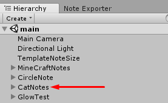

When you click on one of these example notes, you'll see that it has a `NoteDescriptor` attached to it.

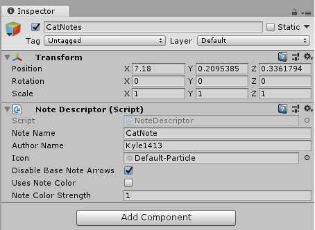

Let's briefly go over what each of these settings do.
### Note Name & Author Name
This one is simple enough. Whatever the note and author name is set to is what will appear in the CustomNotes note selection UI, as shown in the image below.

### Icon
This setting takes an image that will be used as an icon. The icon will display in the CustomNotes note selection UI, as seen in the image above.
### Disable Base Note Arrows
When enabled, this setting will make the default arrows present on notes invisible. Note: you must have `NoteDotLeft` and `NoteDotRight` gameobjects in your note if you want to enable this option.
### Uses Note Color
When this option is enabled, it uses the player's currently set note colors to tint your notes appropriately. This allows your notes to support `CustomColors`. If you want to use this properly, be sure to read the section dedicated to making your notes work with Custom Colors.
### Note Color Strength
This option is only used if `Uses Note Color` is enabled. Note Color Strength defines how strong the tint applied upon your notes is and is one by default. The lower you make this number, the more subtle the tint will be.

## Creating a note
You should already have a 3d model that you're going to use for your note. For this tutorial I'm going to be using a simple triangle mesh I made in blender. Go ahead and import your model into the project.

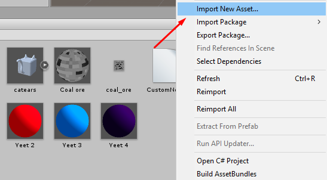

Once you've imported your model, create a new empty `GameObject` in the hierarchy view and name it whatever you plan on naming your note. I'll be naming mine `TriangleNote`.

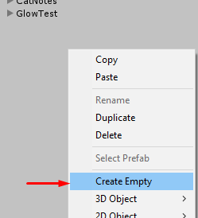

In your note's `GameObject`, click `Add Component` and add a `NoteDescriptor`. Don't worry about changing any of the options in the `NoteDescriptor` right now, we'll do that later.

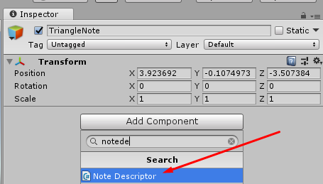

Now we can go ahead and start adding children to our custom note's main GameObject. `NoteLeft` and `NoteRight` are the two required notes, but you can also add a `NoteDotRight`, `NoteDotLeft`, or `NoteBomb` to your main GameObject. For the purposes of this tutorial I'm only going to be making a `NoteLeft` and `NoteRight`.

Go ahead and create a new empty GameObject inside of your main GameObject and name it `NoteLeft`

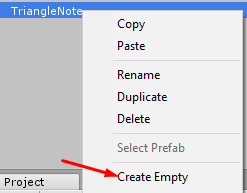

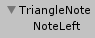

`NoteLeft` will serve as a kind of "container" for all of the GameObjects that contain meshes in our note. We'll be able to position and rotate our meshes freely if we put them in a seperate GameObject inside of `NoteLeft`, which we would not be able to do if we simply added mesh components directly to the `NoteLeft` GameObject.

Go ahead and drag and drop your imported mesh onto `NoteLeft` in the hierarchy view.

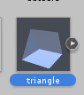

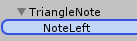

You should now have your a child GameObject of `NoteLeft` containing your mesh. Depending on what modeling program you used, you may need to remove some non-mesh objects. If you see any objects in your mesh named `Camera` or `Lamp`, **MAKE SURE YOU DELETE THEM!** If you see a warning about "breaking the prefab instance", press "Continue".

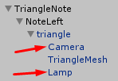

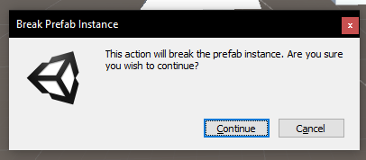

Click on the object you just added and make sure that it has a position of `(0,0,0)`

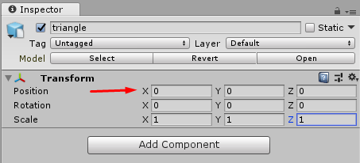

Once you've selected the mesh you need to properly scale it to be the size of an note in-game. Select `NoteLeft` and move it near the `TemplateNoteSize`. The `TemplateNoteSize` should be the white square in your project.
::: warning WARNING
Make sure you select `NoteLeft` when you're moving your note. If you accidentally move the children of `NoteLeft` instead, the meshes will not be aligned! The meshes inside of `NoteLeft` should almost ALWAYS be at position `(0,0,0)` unless you're purposefully adjusting them.
:::

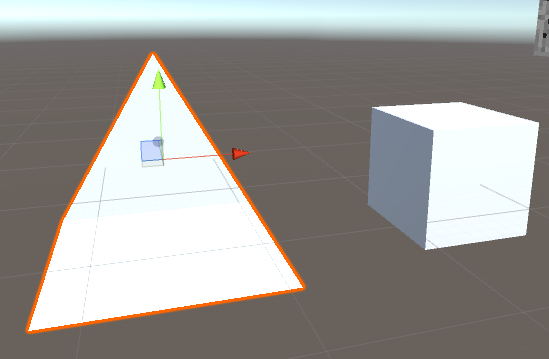

Once you've moved `NoteLeft` to be near the `TemplateNoteSize`, select the scale tool near the top left of the screen.

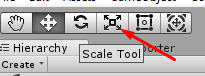

With the GameObject inside of `NoteLeft` selected, click and drag on the gray square and move your mouse until your note is roughly the same size as the `TemplateNoteSize`.

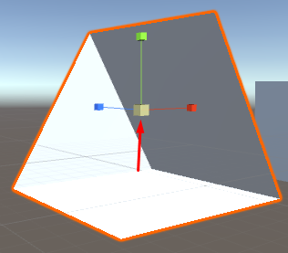

::: warning WARNING
Make sure you're adjusting the scale of the objects INSIDE of `NoteLeft`. `NoteLeft` will always have a forced scale of one, so if you set its scale to anything other than `(1,1,1)` your model will look different in-game!
:::

As you can see, the scale that worked for my mesh is about `(0.65,0.65,0.65)`. This value will probably be different depending on what mesh you're using. If you can't get the mesh to be exactly the same size as the `TemplateNoteSize` don't worry too much because it doesn't need to be exact. Keep in mind that having a note be slightly too large is generally better than having it be slightly too small.
::: warning WARNING
Make sure your notes are facing the correct direction. Look at the direction all of the other notes in the scene and ensure that your meshes are facing the same way. **REMEMBER**: The `NoteLeft` GameObject should always have a rotation of `(0,0,0)`. If you need to rotate your note, don't rotate `NoteLeft`, but instead rotate the meshes inside of it!
:::

## Adding materials
Now that the mesh is properly scaled we can go ahead and add a material to it. In the project window, right click on `Materials` and then do `Create->Material`. Since this is going to be the material for the mesh of my `LeftNote`, I'll name it `LeftMaterial`.

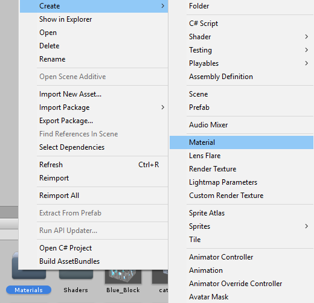

Now that we have LeftMaterial, we have to choose which shader to use for it. If you use any of the default Unity shaders they won't show up ingame properly, so we have to use one of the `BeatSaber` shaders.

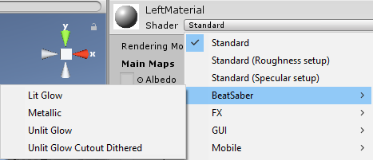

For my LeftMaterial, I'm going to use `Unlit Glow`. However, you may want to use a different shader depending on your mesh. Here are the main differences between the shaders:

* Lit glow is lit and has shadows. You can change the direction the light comes from and how strong it is
* Metallic makes the material slightly darker and allows you to add a metallic reflection
* Unlit glow is similar to lit glow but it doesn't have any lighting effects.
* Unlit glow cutout dither is the same as unlit glow but allows you to add transparency to your material.

All four of these shaders also allow you to use textures, although Metallic uses the texture for the reflection instead of applying it directly.

Once you've selected your shader, go ahead and pick a color for your left material. Since this is the left block, i'm going to pick a reddish color.

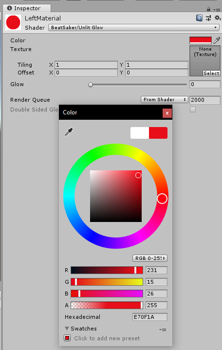

Now that the color is set, go back to your mesh and set it as the material.

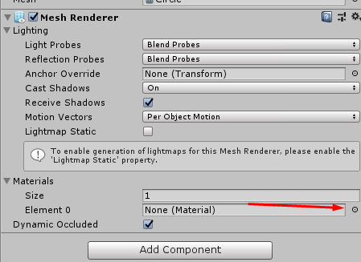

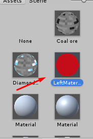

Your note should now have a material that shows up properly ingame. Now we need to create a right note and do the same thing again. Right click on `NoteLeft` and `Duplicate` it. Rename this duplicate `NoteRight`.

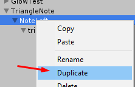

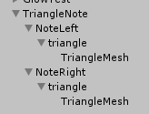

Now, follow the steps above again to create a second material. Make sure to use the same shader if you want the notes to look consistent between colors. For my second material, I'm going to name it RightMaterial and give it a blue color.

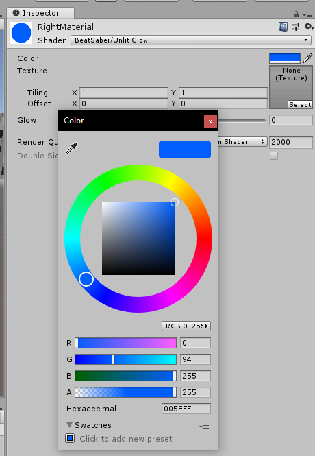

Now that you have the second material, apply it to the mesh of the `NoteRight`.

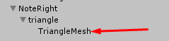

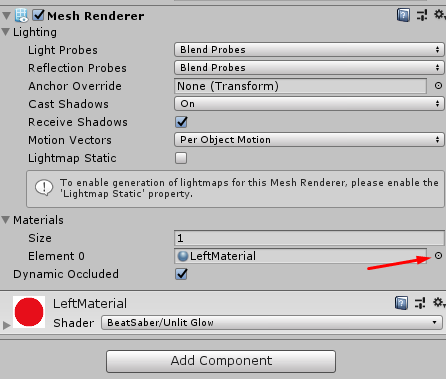

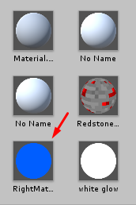

You now have two notes, both of which are properly textured and will show up ingame.

## Exporting your notes

Now that our meshes and materials are properly set up, we can go back to the `NoteDescriptor` and change the settings. Go to your note's main GameObject and look at the `NoteDescriptor` in the properties panel.

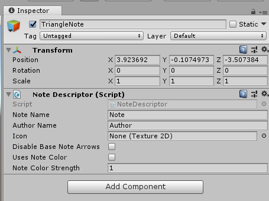

Set the `Note Name` to what you want your note to be called ingame. I'll set mine to "Triangle Notes". Additionally, set the `Author Name` to the name you want to be credited by. I'll be setting mine to "Bobbie".

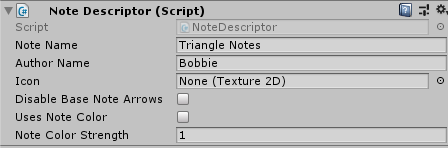

::: warning WARNING
Although it's not technically required, it is highly recommended you add an icon to your notes so that they are easier to identify in the UI.
:::

Import the image you're going to use for your icon by clicking `Import New Asset`. I'll be using a triangle icon I made.

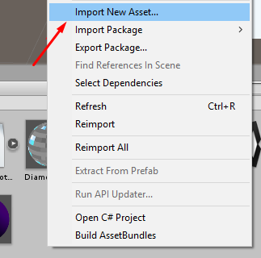

If your image has transparency, make sure to check `Alpha Is Transparency` and click apply.

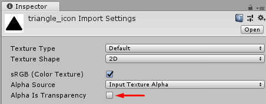

Now go back to the `NoteDescriptor` and select the image you just imported.

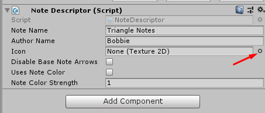

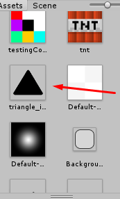

Now we have three options left - `Disable Base Note Arrows`, `Uses Note Color`, and `Note Color Strength`. Because my model does not have any custom arrows, I'm going to leave `Disable Base Note Arrows` unchecked so we can keep the default arrows. I'm going to leave `Uses Note Color` unchecked for now too, which means that we don't need to change `Note Color Strength` either.

::: warning WARNING
If you're going to enable `Uses Note Color` - and I highly recommend you do - make sure to read the section on how to support custom colors correctly!
:::

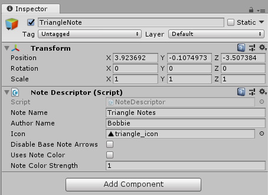

Now that our `NoteDescriptor` options are completely set, we can export our note using the `Note Exporter`. To get to the `Note Exporter`, look for the tab on the left of your screen, near the `Hierarchy` tab.

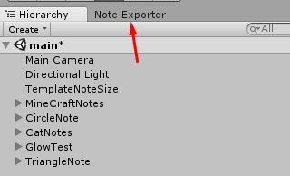

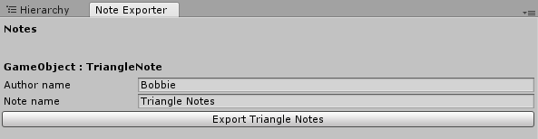

Your note should be at the top of the `Note Exporter`. Once you're sure that all of your `NoteDescriptor` settings are correct, click the export button below your note in the `Note Exporter`. Make sure to export it into your `Beat Saber/CustomNotes` folder so you can test it ingame.

::: warning WARNING
If you're going to export a note again, make sure to delete the old version. The Note Exporter won't export a note if there's already a note with an identical name in the same folder.
:::

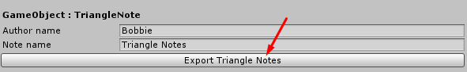

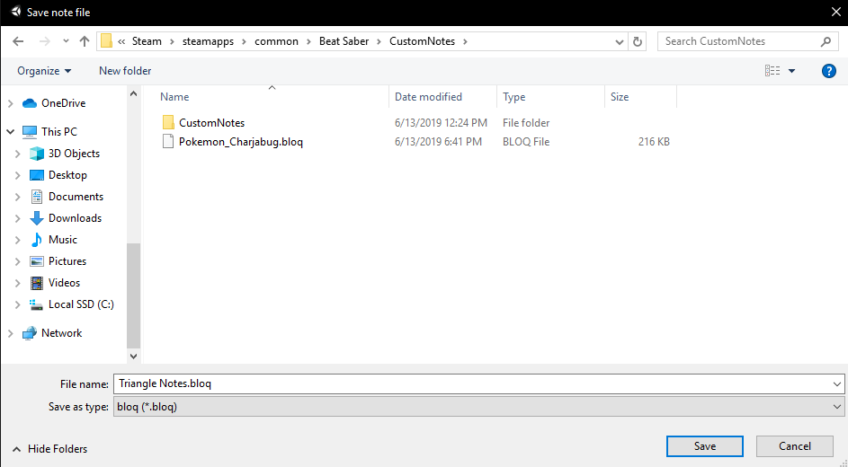

::: tip TIP
If you own beat saber on steam and want to see how your notes look ingame without putting on your headset, the `fpfc` launch argument is extremely helpful and allows you to control the ingame camera using your mouse
:::

Now that your notes are exported, you can start beat saber and see how they look ingame. In beat saber, click `Mods` and then `CustomNotes`. If you did everything correctly, you should see your notes in the list.

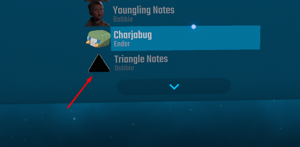

Select your notes and try playing a song.

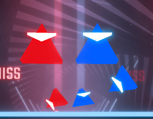

If everything looks good ingame, you should be finished! Make sure to try playing with your notes with your headset on at least once before releasing them.

## Custom Colors
This section is assuming you already have a custom note fully set up and simply want to add support for custom colors, which is highly recommended because it will almost always enhance the user experience.

CustomColor support works by tinting the notes the current player-set color. If your material has a texture, lighter colors will be tinted more, whilst darker colors will be tinted less.

Go ahead and create a new material in the `Materials` folder. With CustomColor support, generally you're going to be using the same material for both the left and right note, so I'm going to name my material `NoteMaterial`.

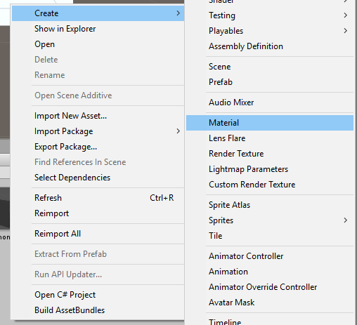

Now select the shader you want to use for your note. If you're not sure which shader you want to use, refer back to the `Adding Materials` section of this guide. For my note, I'm going to use `Unlit Glow`.

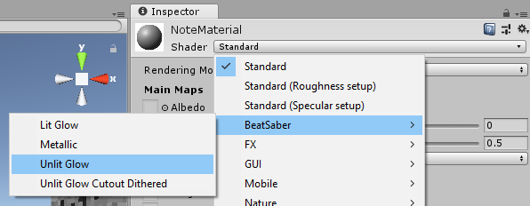

Now apply this material to both your NoteLeft mesh and your NoteRight mesh. Make sure to apply it to BOTH!

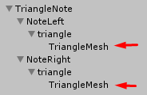

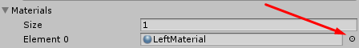

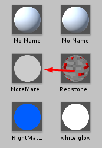

Now that you're done applying the material to all of your note's meshes, go back to the `NoteMaterial` in the inspector. To double check that your notes look good when using CustomColors, try messing around with the `Color` property - this is what property will be changed when the notes are tinted.

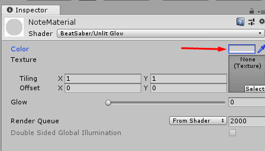

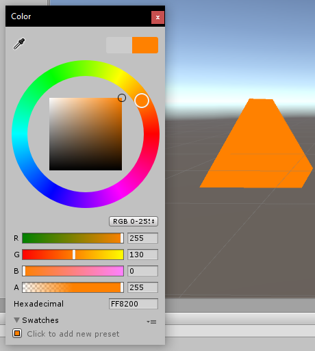

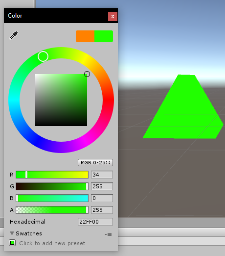

Once you've confirmed that the notes change color when you change the material's `Color` property, go to your note's main GameObject and go to the `NoteDescriptor`. Enable `Uses Note Color` and feel free to mess around with `Note Color Strength`. When Note Color Strength is at 1, it will tint the color with 100% strength. The lower you go from one, the more subtle it will be. For the purposes of this tutorial, I will be leaving `Note Color Strength` at one.

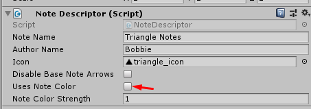

Your note should now be compatible with Custom Colors! Go ahead and re-export it. If you need a refresher, read the section on Exporting up above.

### Disable Custom Colors on certain GameObjects

In some cases, you may want CustomColors to not affect a certain mesh. For example, if you have a part of your model that needs to say the same color, such as an arrow needing to be white. There is a simple solution to this problem.

In this example, I have two meshes inside of my `LeftNote` object. I want the `TriangleMesh` to be affected by custom colors, but not `SmallerTriangleMesh`.

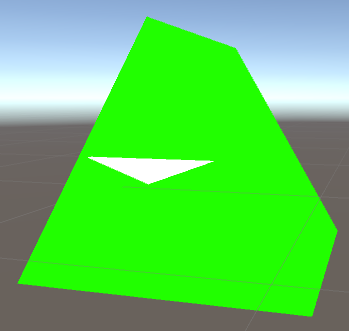

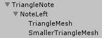

All you have to do is go into the GameObjects that you do not want to be affected by custom colors and add a `Disable Note Color On GameObject` component. Any GameObject with this component will retain how it looks and not be affected by custom colors.

::: warning WARNING
Remember to apply these changes to all of the notes in your CustomNote!
:::

