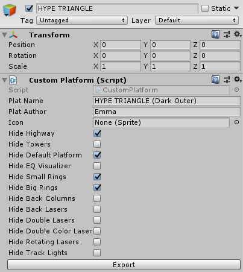
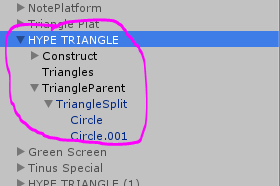
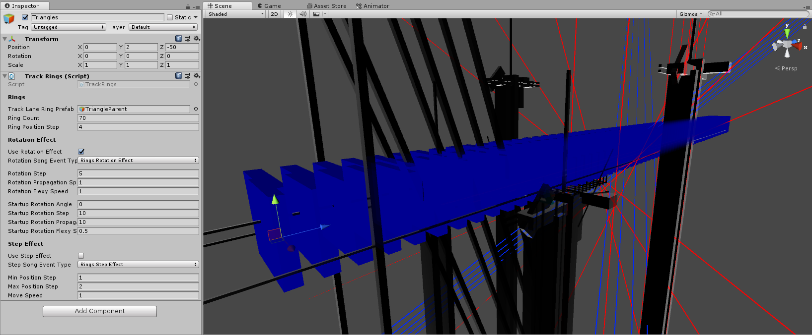
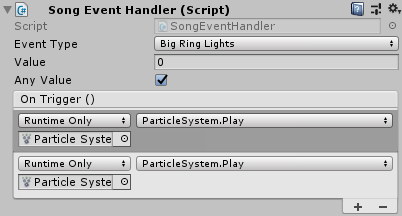
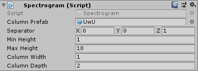
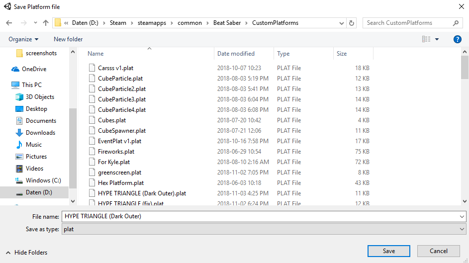
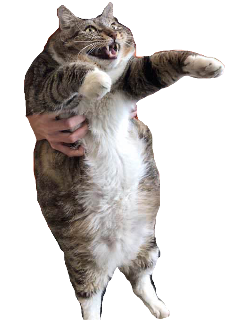

# Custom Platforms Guide
_Emma's Guide to making Custom Platforms_

## Project
Open the current [Custom Platforms Project](https://github.com/rolopogo/CustomPlatforms/releases) with [Unity 2018.1.6f1](https://download.unity3d.com/download_unity/57cc34175ccf/Windows64EditorInstaller/UnitySetup64-2018.1.6f1.exe).

## First Steps

Create an `Empty GameObject` by right clicking in the Hierarchy window and selecting `Create Empty`. Make sure to set its position in the Inspector to the origin (0,0,0). Search in the inspector for the `Custom Platform` script and apply it to this GameObject. Everything inside this Object will be exported when the button on the `Custom Platform` script is pressed. In the script there are also Exporting options. These disable parts of the original platform (For when you want to replace something partially).

## Adding Models

Drag all models you want in your Platform into the GameObject created in the second step and position them to your liking. For the materials of the models make sure to use Beat Saber compatible shaders or the ones that you can find in the Project called `_dark_replace` and `_glow_replace`. These are custom Materials that act like the Beat Saber materials, aka react to the tube lights and mist.

### Track Rings
The `Track Rings` script makes track rings like seen in the game. To achieve this, the script takes a prefab. Currently I haven't been able to figure out how to use a prefab in it, so I used a gameObject, that is part of the platform hierarchy, that I later moved off to `y = -1000`. For the ring-preview to show correctly, move this gameObject to (0,0,0) and adjust your settings and before importing move it off to somewhere offscreen.

Enabling the rotation effect, makes the rings rotate by the specified event, depending on the variables it's given. (I haven't played around with these yet so experiment).

Enabling the step effect changes the rings spacing when the specified event is called between 2 variables.

### Tube Light

This script enables blinking lights. Putting this on an empty gameObject changes the background and adds a bit of color to that space, according to the light ID's. When there's also a mesh renderer on it, it'll change the meshes color according to the light ID's. When using this no color adding is needed, so I change the size on the script to 0.

### Song Events

The event manager is the most useful script. With it you can trigger an action on any beat saber event (even unused ones). For adding an event press the `+` button underneath `On Trigger ()`. Drag in the object you want to manipulate into the box that just got created. Press the dropdown menu to the right and choose what that object should do, by first selecting what component, then what action. Make sure that you only use 1 event Handler per gameObject, as only 1 will work per gameObject.

### Spectogram

The spectrogram script works like the track rings script and also requires a prefab or gameObject. This will get stretched and shrunk according to the sound of the game and the variables provided. (Haven't played with this either).

## Exporting

Export the platform trough the script that you previously added to the gameObject to the location of your choosing. Preferably the game's directory `Beat Saber/CustomPlatforms`.
::: tip NOTE
**Once you've got your new sabers working**, [upload them to ModelSaber](https://modelsaber.com/Upload/) if you want to share them with the world.
:::

