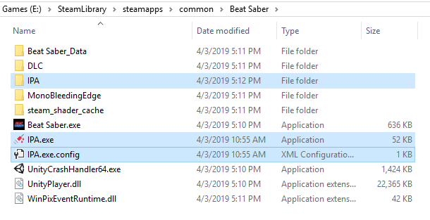
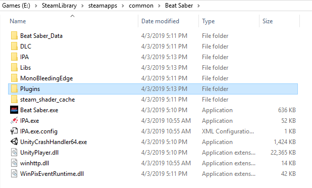

# PC Modding
# Preface

::: danger DISCLAIMER
By choosing to use mods, you understand that:
- You may experience problems that don't exist in the vanilla game. 99.9% of bugs, crashes, and lag are due to mods.
- Mods are subject to being broken by updates and that's normal - be patient and respectful when this happens, as modders are volunteers with real lives.
- Beat Games aren't purposefully trying to break mods. They wish to work on the codebase and sometimes this breaks mods, but they are not out to kill mods.

Do not attack the devs for issues related to mods, and vice versa - modders and devs are two separate groups. Just don't be a jerk ok.
:::

Beat Saber natively supports custom songs, so if that's all you're looking for, you don't require more mods! It's a wise idea to install `SongCore` though, as this mod expands upon the base game functionality to improve loading times and provide functionality for other mods like the in-game downloader, custom leaderboards, playlists, etc.

::: warning
Every time the game updates, you will have to do this process again to get all compatible mods. 
Since mods are made by volunteers, you may need to wait for your favorite mod to be fixed for the latest game version. Make sure to check the #server-announcements channel in the discord for the latest updates!
:::

::: warning
This guide is for PC-modding on Windows.  
If you have a Quest, see the [Quest Modding page](/quest-modding.md).  
If you're on Linux, check out the [Linux page](/modding/linux.md) or [QBeat](https://github.com/geefr/beatsaber-linux-goodies/blob/master/README.md)
:::

If you run into problems at any point, please head to the [support page](./support.md#1-4-no-mods-in-game) and see if you can identify what went wrong before asking in the Discord server. Chances are, your answer is on that page!

## Installers
### Mod Assistant
> **THIS IS CURRENTLY THE RECOMMENDED MOD INSTALLER.**

__**Run the game at least once**__ before trying to mod the game! This applies to reinstalling your game too. 

A simple Beat Saber Mod Installer similar to the mod manager, but with additional features such as mod removal and version checking! Get it on [Assistant's GitHub](https://github.com/Assistant/ModAssistant/releases/latest)

## How to get more songs
### In-game Downloader
The `BeatSaver Downloader` Plugin allows you to download maps in-game using the `MORE SONGS` menu button on the `MODS` menu screen. This pulls maps directly from [BeatSaver](https://beatsaver.com)

### BeatSaver
[BeatSaver](https://beatsaver.com) is the central repository that holds nearly all custom songs/maps for Beat Saber.
To install songs downloaded from the site, unzip them into a folder and place it into `Beat Saber/Beat Saber_Data/CustomLevels`.  You can also use the in-game downloader plugin.

There are a couple more resources to help you find songs over in the [FAQ](./faq.md#more-songs)

### Beast Saber
[Beast Saber](https://www.bsaber.com) (bsaber.com) is a site that tries to help make finding fantastic maps to play easier. It does this by categorizing the thousands of songs on beatsaver and lets you sort by a song's genre and many other attribute tags. It also has a full social feature where players can review songs and comment on them. One of the most used features is the "Curator Recommended" feature where a team plays through most songs released each day and recommends the ones that stand out, letting you [automatically download these in-game](https://bsaber.com/beatsync/).

### Song Management Apps
* [BeatDrop](https://bsaber.com/beatdrop/) isn't just for mods, it also allows you to download songs and create playlists. 
* [BeatList](https://github.com/Alaanor/beatlist) is an app to manage playlist and beatmaps, by Alaanor.

## How to uninstall mods
**Currently the only way to uninstall a mod is to remove the dll from the `Plugins` folder.**
|  |  |
| --- | --- |
| Steam | `\steamapps\common\Beat Saber\Plugins` |
| Oculus | `\hyperbolic-magnetism-beat-saber\Plugins` | 

## Manual Installation
Only resort to this if you absolutely know what you're doing! A mod installer is the recommended way to install mods. See the section [above](#installers).

**Run the game at least once** before trying to mod the game! This applies to reinstalling your game too. 

1. Download [BSIPA](https://github.com/beat-saber-modding-group/BeatSaber-IPA-Reloaded/releases).
2. Navigate to your [install folder.](/faq/install-folder.md) and extract the contents of BSPIA into it.

3. Double click IPA.exe to patch the game. Any mods in the `Plugins` folder will now be loaded when starting the game. If there are errors, you probably didn't follow step 2 correctly.

4. Download the mod(s) you wish to install, whether it be from GitHub, the #finished-mods channel, or other sources. **Make sure to download any dependencies required by the mod.**

5. Some mods have installation instructions, some don't. Generally you can just drag and drop the zip contents into your beat saber install folder, and the files should go into the corresponding folders. 

## Where to go from here
* [Grips and Tricks](./grips-and-tricks.md)
* [Making Beatmaps](/mapping/)
* [Custom Sabers](/models/custom-sabers.md)
* [Custom Avatars](/models/custom-avatars.md)
* [Custom Platforms](/models/custom-platforms.md)
* [Setup Multiplayer](https://bs.assistant.moe/Multiplayer/)
* [Making Mods](/modding/)

## Have questions?
Visit the [FAQ](/faq/) or drop by the `#support` tab in the [BSMG Discord](https://discord.gg/beatsabermods)!
