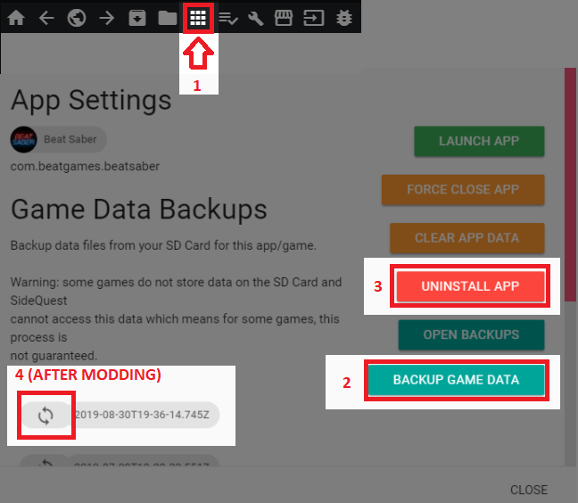
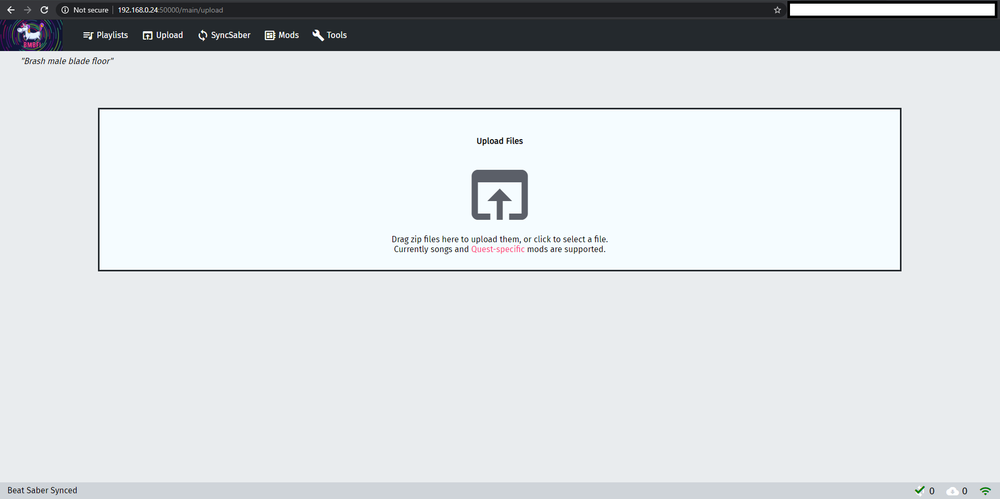

# Quest Modding

## Installation 

Currently the only recommended way to install custom songs and mods is BMBF sideloaded with SideQuest.
* [BMBF apk](https://bmbf.dev/stable)

### Installing BMBF with SideQuest

If you haven't already, download and setup [SideQuest](https://sidequestvr.com/#/setup-howto)

Open SideQuest and connect your Quest to your PC. If you've previously modded Beat Saber or have scores you want to backup, go to `My Apps` located in the top bar of the window and find Beat Saber.

Click the cog next to it then press the `BACKUP GAME DATA` button, if you have a modded game you also need to uninstall it by pressing the `UNINSTALL APP` button.

You can later restore your save from the same menu, after modding.

Install the latest BMBF apks via the `Install APK from folder` button shown below.

Once they've successfully installed, make sure you have the latest version of Beat Saber installed and unmodded. 
:::warning
Run Beat Saber once and close it before modding!
:::

After running Beat Saber once, open BMBF from Oculus TV channels tab or Unknown Sources in your library. Follow each step exactly as you're told, and then you should be see [bsaber.com](https://www.bsaber.com). This is where you can download any custom songs available.

## Restoring save data

### Restoring from SideQuest

Go back to the same menu you used to backup your data and click the `OPEN BACKUPS` button.
From there, find your newest backup folder, open it, and delete the Mods folder (this is to prevent potentially old or incompatible mods from breaking your game).

Afterwards, go back to the menu and press the circular arrows located beside your latest backup. This is to restore your scores.
The button is highlighted in the image [here](#installing-bmbf-with-sidequest).

## Installing songs and mods

### Installing mods from your PC

:::warning
Make sure your quest and PC are on the same network!
:::

Open BMBF in your Quest and go to the `Tools` tab, there you should see a web address and a version number similar to what's show below.

On your PC, open your browser and type the address into the search bar.

You should be greeted with this screen below.

Now just drag any Quest compatible mods into the upload box and sync. If the mod was originally made for an older version, then it won't automatically enable. To enable an old mod, go to the `Mods` tab and enable it from there.

If you want to use the same method of downloading songs as you do in BMBF in your Quest, just replace `upload` in the URL with `browser`.

### Installing songs in the headset

There are two main ways to install songs from inside your Quest. You can either use BeastSaber, the default webpage BMBF loads into, or you can use BeatSaver.

If you're looking for curated maps and pre-made playlists to download BeastSaber is your best bet, however if you just want a specific song, or you aren't a fan of BeastSabers UI, BeatSaver is a much better option as its search is a lot easier to use in the headset.

You can switch between the two sites, and other sites including SideQuest's mod page, using the globe icon in the top right of the browser window.

## Useful links and alternative guides

* [Oculus Quest BMBF Installation Guide](https://bsaber.com/oculus-quest-custom-songs/)
* [General Guide by Sc2ad for Learning The Basics of Asset Modding](https://github.com/sc2ad/beat-saber-community-wiki/blob/master/asset-modding-guide.md)
* [Collection of All Current Guides for Asset Mods Such As Sabers and Notes Made by RedBrumbler](https://github.com/RedBrumbler/BMBFCustomSabers/wiki/RedBrumblers-Asset-Mod-Guide-Wiki)
* [Guide for Making Qsabers (PC like sabers on Quest)](https://github.com/RedBrumbler/BMBFCustomSabers/wiki/Creating-Qsabers)
* [Fixing Out of Sync Audio](https://bsaber.com/quest-out-of-sync/)

## Troubleshooting
### Adding mods from the headset/bsaber.com doesn't work
The reason adding mods and sabers from [Beastsaber](https://bsaber.com/) doesn't work is because those mods and sabers are intended for PC Only. To add mods and sabers for the quest use the BMBF Web Interface [How To Access BMBF Web Interface](https://bsmg.wiki/quest-modding.html#installing-mods-from-your-pc) 

Get Quest compatible Sabers and Mods from [RedBrumbler's Github](https://github.com/RedBrumbler/BMBFCustomSabers) or `#quest-mods`, `#quest-assets` in the Beat Saber Modding Group Discord and use the .zips you download to install them in the BMBF Web Interface, please make sure the mod you're downloading works with you're Beat Saber version, a lot of time is spent by support members simply telling someone the mod they downloaded is outdated, so try to make sure it's compatible to save some time in the future.
___
### Sideloading BMBF failed

If, when sideloading BMBF, you get the error `INSTALL_FAILED_UPDATE_INCOMPATIBLE: Package com.weloveoculus.BMBF signatures do not match the previously installed version; ignoring!"` it means you need to uninstall your previously installed version. You can do this from SideQuests `My Apps` menu, the same menu you used to uninstall Beat Saber.

___
### BMBF web interface not loading
If your BMBF Web Interface is not loading be sure that you're typing the ip from the tools tab into your browser on your computer thats on the same network.
Make sure that:
1) Your IP is not `127.0.0.1`
2) BMBF is open in the headset
3) There is `http://` at the beginning of the link, not `https://`
4) You have `:50000` at the end of your link
___
### BMBF not loading configuration after a few minutes
This is likely due to using an outdated version of Beat Saber being used with BMBF.
If you are not using an outdated version then try restarting your headset, and if it continues use the BMBF Web Interface to click Quick Fix. 
___
### My Sabers and Mods wont enable/work!
This is most likely due to having an outdated BMBF Client, grab the latest [BMBF Release](https://bmbf.dev/stable). If the BMBF version for your Beat Saber is not there then please wait a while for the unicorns to update BMBF.  
* If your mod is supposed to be compatible with your version of BMBF, then make sure there is no folder separating the contents of the .zip file. 
* If your level doesn't load then try installing mapping extensions from #quest-mods
* If your BMBF is on the latest version and mods wont be enabled in game then uninstall Beat Saber with the uninstall BS button in the BMBF Tools tab and reinstall and remod.
___
### My Beat Saber gets 3 dots when I launch!
If your Beat Saber is getting 3 dots when launching make sure that:
1) You launched and played one song before modding the game
2) You're not using a pirated version of the game
3) Make sure you're using the latest version of BMBF
