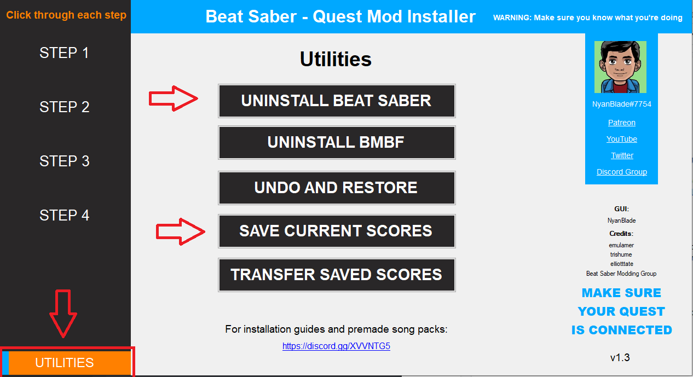
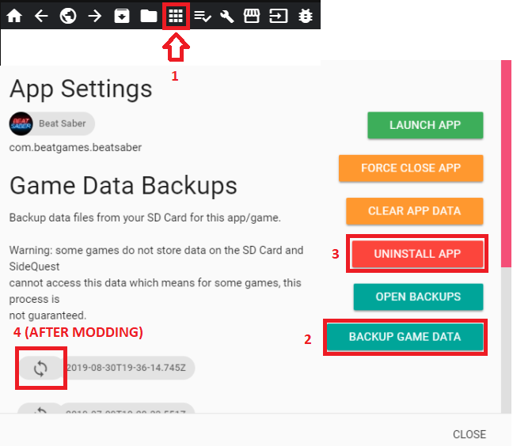

# Quest Modding

## Installation 

Currently there are two working tools for installing custom songs and mods on your Quest:
* [BeatSaberQuestInstaller (windows only GUI for installing BMBF)](https://github.com/NyanBlade/BeatSaberQuestInstaller/releases)
* [BMBF installed via SideQuest](https://github.com/kihecido/BMBF/releases)

For new users, BeatSaberQuestInstaller may be easier to use as it handles some of the more confusing parts of modding/updating a modded game, such as restoring scores and installing adb.

### Installing with BeatSaberQuestInstaller

Before starting the process go to the utilities tab and backup your scores, if you've previously modded Beat Saber you also need to go there to uninstall the game, make sure you backup **BEFORE** uninstalling.

Once you've done what you need, if you're a new user follow all the steps from step 1 and if you're a returning user skip to step 4 in the installer, after completing the steps open BMBF from the channels tab in Oculus TV or Unknown Sources in your library.

### Installing BMBF with SideQuest

If you haven't already, download and setup [SideQuest](https://sidequestvr.com/#/setup-howto)

Open SideQuest and connect your Quest to your PC. If you've previously modded Beat Saber or have scores you want to backup, go to `My Apps` located in the top bar of the window and find Beat Saber.

Click the cog next to it then press the `BACKUP GAME DATA` button, if you have a modded game you also need to uninstall it by pressing the `UNINSTALL APP` button.

You can later restore your save from the same menu, after modding.

Install the latest BMBF apks via the `Install APK from folder` button shown below.

Once they've successfully installed, make sure you have the latest version of Beat Saber installed and unmodded **RUN IT ONCE BEFORE MODDING** then open BMBF from Oculus TV channels tab or Unknown Sources in your library, follow each step exactly as you're told and
once you have you should be put into [bsaber.com](https://www.bsaber.com) this is where you can download any custom songs available.

## Restoring save data

### Restoring from BeatSaberQuestInstaller

Make sure you've ran the game modded once and go to the `UTILITIES` tab in the app and press the `TRANSFER SCORES` button.

### Restoring from SideQuest

Go back to the same menu you used to backup your data and click the OPEN BACKUPS button.
From there, find your newest backup folder, open it, and delete the Mods folder (this is to prevent potentially old or incompatible mods from breaking your game).

Afterwards, go back to the menu and press the circular arrows located beside your latest backup; this is to restore your scores.
The button is highlighted in the image [here](https://github.com/beat-saber-modding-group/wiki/blob/master/wiki/quest-modding.md#installing-bmbf-with-sidequest).

## Useful links and alternative guides

* [Oculus Quest BMBF Installation Guide](https://bsaber.com/oculus-quest-custom-songs/)
* [General Guide by Sc2ad for Learning The Basics of Asset Modding](https://github.com/sc2ad/beat-saber-community-wiki/blob/master/asset-modding-guide.md)
* [Collection of All Current Guides for Asset Mods Such As Sabers and Notes Made by RedBrumbler](https://github.com/RedBrumbler/BMBFCustomSabers/wiki/RedBrumblers-Asset-Mod-Guide-Wiki)
* [Fixing Out of Sync Audio](https://bsaber.com/quest-out-of-sync/)
